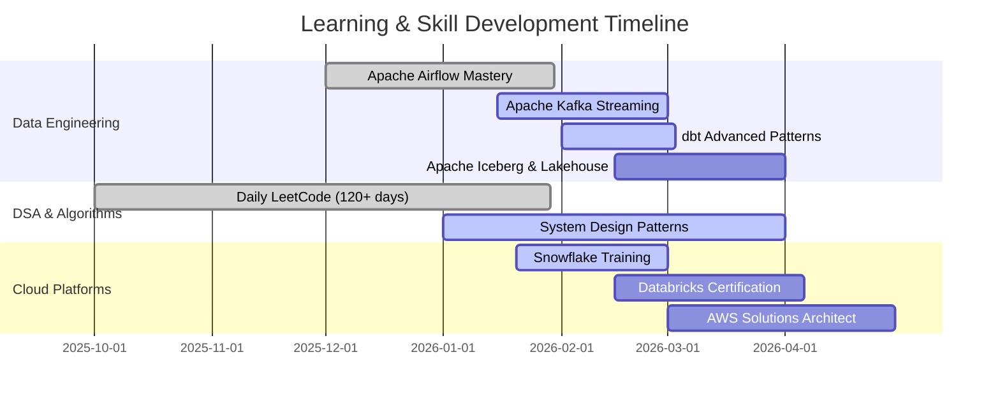

<div align="center">

<!-- ═══════════════════════════════════════════════════════════════════════════
     HEADER SECTION - Animated Banner + Typing Effect
     ═══════════════════════════════════════════════════════════════════════════ -->


<!-- Animated Typing - Fixed width for full text visibility -->
<a href="https://git.io/typing-svg">
  
</a>

<br/>

<!-- Social Badges -->
<a href="https://linkedin.com/in/sumanth-malipeddi">
  
</a>&nbsp;
<a href="mailto:sumanth.9666@gmail.com">
  
</a>&nbsp;
<a href="https://x.com/Sumanth9666">
  
</a>&nbsp;
<a href="https://github.com/sumanthmalipeddi">
  
</a>

<br/><br/>

<!-- Profile Stats -->

&nbsp;

&nbsp;


</div>

---

<!-- ═══════════════════════════════════════════════════════════════════════════
     NAVIGATION - Tile Style
     ═══════════════════════════════════════════════════════════════════════════ -->

<div align="center">

<table>
<tr>
<td align="center" width="16%">
<a href="#-learning-journey">
<br/>
<b>📚 Learning</b>
</a>
</td>
<td align="center" width="16%">
<a href="#-about-me">
<br/>
<b>👨‍💻 About</b>
</a>
</td>
<td align="center" width="16%">
<a href="#-professional-experience">
<br/>
<b>💼 Experience</b>
</a>
</td>
<td align="center" width="16%">
<a href="#%EF%B8%8F-tech-stack">
<br/>
<b>🛠️ Tech Stack</b>
</a>
</td>
<td align="center" width="16%">
<a href="#-featured-projects">
<br/>
<b>🚀 Projects</b>
</a>
</td>
<td align="center" width="16%">
<a href="#-lets-connect">
<br/>
<b>📫 Connect</b>
</a>
</td>
</tr>
</table>

</div>

---

<!-- ═══════════════════════════════════════════════════════════════════════════
     LEARNING JOURNEY - First Section as requested
     ═══════════════════════════════════════════════════════════════════════════ -->

## 📚 Learning Journey

<div align="center">

### 🔥 Consistency Streaks

<table>
<tr>
<td align="center" width="33%">
<br/><br/>
<br/><br/>
<b>German Practice</b><br/>
<sub>Daily Language Learning</sub>
</td>
<td align="center" width="33%">
<br/><br/>
<br/><br/>
<b>Brilliant</b><br/>
<sub>Math & Computer Science</sub>
</td>
<td align="center" width="33%">
<br/><br/>
<br/><br/>
<b>LeetCode</b><br/>
<sub>Daily DSA Practice</sub>
</td>
</tr>
</table>

<br/>

### 📖 Currently Reading

<table>
<tr>
<td align="center" width="33%">
<h4>📘 Fundamentals of Data Engineering</h4>
<sub>Joe Reis & Matt Housley</sub><br/><br/>
<br/><br/>
<sub>Finished all chapters including<br/>Security & Future of DE</sub>
</td>
<td align="center" width="33%">
<h4>📗 Hands-On Machine Learning</h4>
<sub>Aurélien Géron</sub><br/><br/>
<br/><br/>
<sub>Deep diving into ensemble<br/>methods & neural networks</sub>
</td>
<td align="center" width="33%">
<h4>📙 Designing Data-Intensive Apps</h4>
<sub>Martin Kleppmann</sub><br/><br/>
<br/><br/>
<sub>Starting with data models<br/>& query languages</sub>
</td>
</tr>
</table>

<br/>

### 🗓️ 2026 Learning Roadmap



<details>
<summary><b>📝 Recent Learning Highlights</b></summary>
<br/>

| Day | Focus | Learning |
|:---:|:---:|:---|
| 136 | Airflow | Built custom `PostgresToS3Operator` with templating |
| 135 | ETL | Postgres → S3 → Docker Pandas workflow |
| 134 | DSA | Kadane's Algorithm for max subarray O(n) |
| 131 | DSA | Dutch National Flag: 3-way partitioning |
| 130 | Airflow | Branching with `BranchPythonOperator` |

</details>

</div>

---

<!-- ═══════════════════════════════════════════════════════════════════════════
     ABOUT ME
     ═══════════════════════════════════════════════════════════════════════════ -->

## 👨‍💻 About Me

<table>
<tr>
<td width="50%" valign="top">

```yaml
name: Sumanth Malipeddi
role: Associate Data Science Engineer
company: GetMySaas
location: Tirupati, Andhra Pradesh, India
education: MS Data Science & AI | IISER Tirupati
gpa: 9.50/10 🏆
experience: 4+ years in data analytics & AI

core_expertise:
  primary: AI Engineering & RAG Systems
  domains:
    - Data Engineering (Airflow, Kafka, dbt)
    - Machine Learning (NLP, Transformers)
    - Cloud Platforms (AWS, Databricks)
    - Databases (PostgreSQL, pgvector)

currently_building:
  - 15+ production Airflow DAGs
  - Kafka real-time streaming pipelines
  - Hybrid search (pgvector + OpenSearch)
  - RAG systems for LLM applications

philosophy: |
  "Production pipelines live in edge cases.
   Real learning happens when things break."
```

</td>
<td width="50%" valign="top" align="center">


<br/>

<table>
<tr>
<td align="center">☕</td>
<td><b>Fuel</b></td>
<td>Coffee + Claude AI</td>
</tr>
<tr>
<td align="center">🎵</td>
<td><b>Music</b></td>
<td>Lo-fi beats</td>
</tr>
<tr>
<td align="center">📚</td>
<td><b>Style</b></td>
<td>Build → Break → Learn</td>
</tr>
<tr>
<td align="center">🌟</td>
<td><b>Belief</b></td>
<td>Every failure teaches</td>
</tr>
</table>

</td>
</tr>
</table>

---

<!-- ═══════════════════════════════════════════════════════════════════════════
     PROFESSIONAL EXPERIENCE - Story Format with Animations
     ═══════════════════════════════════════════════════════════════════════════ -->

## 💼 Professional Experience

<div align="center">

### 🏢 Associate Data Science Engineer @ [GetMySaas](https://getmysaas.com)

<sub>Oct 2025 - Present • Remote</sub>

<br/>


</div>

<br/>

#### 📖 The Story: Fixing Broken Pipelines

```diff
@@═══════════════════════════════════════════════════════════════════════════@@
@@                           THE PROBLEMS I FOUND                            @@
@@═══════════════════════════════════════════════════════════════════════════@@

- Manual data collection eating 40+ hours/week
- CSV NULL semantics causing silent pipeline failures
- Zero semantic search across 10,000+ documents
- Analysts waiting DAYS for fresh data

@@═══════════════════════════════════════════════════════════════════════════@@
@@                          THE SOLUTIONS I BUILT                            @@
@@═══════════════════════════════════════════════════════════════════════════@@

+ 15+ Production Airflow DAGs ──────────────────► 100% Automation
+ Custom NULL-handling Operators ───────────────► 85% Fewer Incidents
+ Hybrid Search (pgvector + OpenSearch) ────────► 87% Answer Accuracy
+ Real-time Kafka Streaming ────────────────────► Minutes, Not Days
```

<br/>

<div align="center">

<table>
<tr>
<td align="center" width="50%" valign="top">

#### 🤖 AI Engineering

<br/>

| Component | Technology |
|:---|:---|
| Semantic Search | `pgvector` embeddings |
| Lexical Search | `OpenSearch` BM25 |
| Hybrid Ranking | Custom algorithm |
| Document Processing | `Tika` + `Tesseract OCR` |

<br/>

| Metric | Result |
|:---|:---:|
| Answer Accuracy | **87%** |
| Docs Processed/Day | **10,000+** |
| Query Latency | **<200ms** |

</td>
<td align="center" width="50%" valign="top">

#### 🔧 Data Engineering

<br/>

| Layer | Pipeline |
|:---|:---|
| Bronze | `Airbyte` → S3 (raw) |
| Silver | `Iceberg` + `dbt` (clean) |
| Gold | `Trino` → Analytics |
| Quality | `Great Expectations` |

<br/>

| Metric | Result |
|:---|:---:|
| Query Speedup | **70%** |
| Analysts Enabled | **50+** |
| DAGs in Production | **15+** |

</td>
</tr>
</table>

<br/>

**Tech Stack**


</div>

---

<div align="center">

### 🎓 MS Research @ IISER Tirupati

**Master of Science in Data Science & Artificial Intelligence**

<sub>Aug 2024 - Aug 2025</sub>

<br/>

<table>
<tr>
<td align="center" width="25%">
<h2>87%</h2>
<b>F1-Score</b><br/>
<sub>Transformer NLP Model</sub>
</td>
<td align="center" width="25%">
<h2>60%</h2>
<b>Time Reduction</b><br/>
<sub>Kafka + Airflow ETL</sub>
</td>
<td align="center" width="25%">
<h2>50GB+</h2>
<b>Data Processed</b><br/>
<sub>99.7% Integrity</sub>
</td>
<td align="center" width="25%">
<h2>45%</h2>
<b>Improvement</b><br/>
<sub>A/B Testing Framework</sub>
</td>
</tr>
</table>

</div>

---

<!-- ═══════════════════════════════════════════════════════════════════════════
     TECH STACK - Tile Format
     ═══════════════════════════════════════════════════════════════════════════ -->

## 🛠️ Tech Stack

<div align="center">

### 🎯 Core Technologies

<table>
<tr>
<td align="center" width="11%">
<br/>
<sub><b>Python</b></sub>
</td>
<td align="center" width="11%">
<br/>
<sub><b>SQL</b></sub>
</td>
<td align="center" width="11%">
<br/>
<sub><b>Kafka</b></sub>
</td>
<td align="center" width="11%">
<br/>
<sub><b>Airflow</b></sub>
</td>
<td align="center" width="11%">
<br/>
<sub><b>Databricks</b></sub>
</td>
<td align="center" width="11%">
<br/>
<sub><b>dbt</b></sub>
</td>
<td align="center" width="11%">
<br/>
<sub><b>Snowflake</b></sub>
</td>
<td align="center" width="11%">
<br/>
<sub><b>AWS</b></sub>
</td>
<td align="center" width="11%">
<br/>
<sub><b>Docker</b></sub>
</td>
</tr>
</table>

<br/>

### 📊 Proficiency Matrix

<table>
<tr>
<td align="center" width="25%" valign="top">
<br/>
<br/>
<sub><b>Primary Focus</b></sub>
<br/><br/>
<table>
<tr><td>RAG Systems</td></tr>
<tr><td>Semantic Search</td></tr>
<tr><td>Vector Databases</td></tr>
<tr><td>LLM Integration</td></tr>
<tr><td>Prompt Engineering</td></tr>
</table>
</td>
<td align="center" width="25%" valign="top">
<br/>
<br/>
<sub><b>Core Expertise</b></sub>
<br/><br/>
<table>
<tr><td>Apache Airflow</td></tr>
<tr><td>Apache Kafka</td></tr>
<tr><td>dbt & Iceberg</td></tr>
<tr><td>ETL Pipelines</td></tr>
<tr><td>Data Quality</td></tr>
</table>
</td>
<td align="center" width="25%" valign="top">
<br/>
<br/>
<sub><b>Strong Skills</b></sub>
<br/><br/>
<table>
<tr><td>NLP & Transformers</td></tr>
<tr><td>MLOps Pipelines</td></tr>
<tr><td>Feature Engineering</td></tr>
<tr><td>Model Monitoring</td></tr>
<tr><td>A/B Testing</td></tr>
</table>
</td>
<td align="center" width="25%" valign="top">
<br/>
<br/>
<sub><b>Advanced</b></sub>
<br/><br/>
<table>
<tr><td>AWS Services</td></tr>
<tr><td>Databricks</td></tr>
<tr><td>Snowflake</td></tr>
<tr><td>PostgreSQL</td></tr>
<tr><td>Redis & OpenSearch</td></tr>
</table>
</td>
</tr>
</table>

<br/>

<details>
<summary><b>🧰 Extended Toolkit</b></summary>
<br/>

| Category | Technologies |
|:---|:---|
| **AI/ML** | TensorFlow • PyTorch • scikit-learn • LangChain • Transformers • spaCy • XGBoost |
| **Data Engineering** | PySpark • Trino • Iceberg • Great Expectations • Airbyte • Celery |
| **Databases** | PostgreSQL • pgvector • MongoDB • OpenSearch • Redis |
| **DevOps** | Docker • Git • GitHub Actions • CI/CD • Linux |

</details>

</div>

---

<!-- ═══════════════════════════════════════════════════════════════════════════
     FEATURED PROJECTS
     ═══════════════════════════════════════════════════════════════════════════ -->

## 🚀 Featured Projects

<div align="center">

<table>
<tr>
<td width="50%" valign="top">

### 1️⃣ Airbnb Data Pipeline

[](https://github.com/sumanthmalipeddi/airflow-postgres-to-s3-pipeline)

**PostgreSQL → AWS S3 with Airflow 3.x**

| Metric | Value |
|:---|:---:|
| Records/Day | **50,000+** |
| Success Rate | **99.8%** |
| Runtime | **45 seconds** |
| Custom | `PostgresToS3Operator` |

`Airflow 3.x` `PostgreSQL` `AWS S3` `Docker`

</td>
<td width="50%" valign="top">

### 2️⃣ Wikipedia Analytics Pipeline

[](https://github.com/sumanthmalipeddi/wiki-pipeline)

**Hourly ETL with Distributed Celery**

| Metric | Value |
|:---|:---:|
| Full ETL | **39 seconds** |
| Availability | **24/7** |
| Processing | **Distributed** |
| Workers | `Celery + Redis` |

`Airflow` `PostgreSQL 16` `Celery` `Redis`

</td>
</tr>
<tr>
<td width="50%" valign="top">

### 3️⃣ Spotify Telugu Songs ETL

[](https://github.com/sumanthmalipeddi/spotify_trending_telugu)

**Serverless Daily Music Collection**

| Metric | Value |
|:---|:---:|
| Architecture | **Serverless** |
| Schedule | **Daily Automated** |
| Storage | **S3** |
| Monitoring | `CloudWatch` |

`AWS Lambda` `Spotipy` `S3` `CloudWatch`

</td>
<td width="50%" valign="top">

### 4️⃣ Resume Intelligence Analyzer

[](https://github.com/sumanthmalipeddi/llm_carrerasst)

**AI-Powered Resume Analysis**

| Metric | Value |
|:---|:---:|
| Skill Extraction | **94.2%** |
| Salary Prediction | `XGBoost` |
| ATS Scoring | **Automated** |
| Interface | `Streamlit` |

`Streamlit` `spaCy` `XGBoost` `AWS EC2`

</td>
</tr>
</table>

</div>

---

<!-- ═══════════════════════════════════════════════════════════════════════════
     ACHIEVEMENTS
     ═══════════════════════════════════════════════════════════════════════════ -->

## 🏆 Achievements & Certifications

<div align="center">

<table>
<tr>
<td align="center" width="25%">
<br/><br/>
<b>MS Data Science & AI</b><br/>
<sub>IISER Tirupati</sub><br/>
<sub>CGPA: 9.50/10</sub><br/>
<sub>Aug 2025</sub>
</td>
<td align="center" width="25%">
<br/><br/>
<b>DS, ML, DL, NLP</b><br/>
<sub>Udemy Bootcamp</sub><br/>
<sub>Complete Course</sub><br/>
<sub>Apr 2025</sub>
</td>
<td align="center" width="25%">
<br/><br/>
<b>Mathematics for DS</b><br/>
<sub>Udemy</sub><br/>
<sub>& GenAI</sub><br/>
<sub>Oct 2024</sub>
</td>
<td align="center" width="25%">
<br/><br/>
<b>AWS Cloud</b><br/>
<sub>Practitioner</sub><br/>
<sub>Certified</sub><br/>
<sub>2024</sub>
</td>
</tr>
</table>

</div>

---

<!-- ═══════════════════════════════════════════════════════════════════════════
     EDUCATION - Simplified
     ═══════════════════════════════════════════════════════════════════════════ -->

## 🎓 Education

<div align="center">

### 🏛️ IISER Tirupati

**Master of Science - Data Science & Artificial Intelligence**

Aug 2024 - Aug 2025

<table>
<tr>
<td align="center" width="50%">
<h2>9.50 / 10</h2>
<sub>CGPA</sub>
</td>
<td align="center" width="50%">
<h2>Top 5%</h2>
<sub>Class Rank</sub>
</td>
</tr>
</table>

<details>
<summary><b>📚 Coursework & Research</b></summary>
<br/>

**Courses:** Mathematics & Statistics • DSA • Database Systems • ML/DL • NLP • Big Data • MLOps • Cloud

**Projects:** Financial Sentiment (87% F1) • Real-time ETL (60% faster) • Resume Analyzer (50GB+)

**Research:** Advanced ML for Predictive Analytics

</details>

<br/>

---

### 🏛️ SASTRA University

**B.Tech Civil Engineering** • 2014 - 2018 • CGPA: 8.542

</div>

---

<!-- ═══════════════════════════════════════════════════════════════════════════
     CONNECT SECTION
     ═══════════════════════════════════════════════════════════════════════════ -->

## 📫 Let's Connect

<div align="center">


### 💬 Open to Collaborations & Opportunities!

<br/>

<table>
<tr>
<td align="center" width="25%">
<a href="https://linkedin.com/in/sumanth-malipeddi">
<br/>

</a><br/><br/>
<b>2,300+ Followers</b>
</td>
<td align="center" width="25%">
<a href="https://github.com/sumanthmalipeddi">
<br/>

</a><br/><br/>
<b>31+ Repositories</b>
</td>
<td align="center" width="25%">
<a href="mailto:sumanth.9666@gmail.com">
<br/>

</a><br/><br/>
<b>Direct Contact</b>
</td>
<td align="center" width="25%">
<a href="https://x.com/Sumanth9666">
<br/>

</a><br/><br/>
<b>Tech Updates</b>
</td>
</tr>
</table>

<br/>

### 🎯 What I'm Looking For

✅ **AI/ML Engineering** at innovative product companies  
✅ **Data Engineering** with modern stack (Airflow, Kafka, dbt)  
✅ **Research collaborations** in RAG and semantic search  
✅ **Open-source contributions** in AI/data engineering

</div>

---

<!-- ═══════════════════════════════════════════════════════════════════════════
     FOOTER
     ═══════════════════════════════════════════════════════════════════════════ -->

<div align="center">


### ⭐ If you find my work valuable, star my repositories!

<br/>


&nbsp;

&nbsp;


<br/><br/>

**© 2025 Sumanth Malipeddi | Building AI systems one pipeline at a time 🚀**

*"The best way to predict the future is to build it with data and AI."*

<sub>Last updated: February 2026</sub>

</div>
