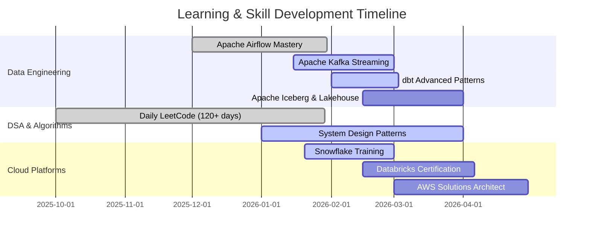

<div align="center">

<!-- Header Banner -->


<!-- Animated Typing -->
<a href="https://git.io/typing-svg"></a>

<!-- Social Badges -->
<p align="center">
  <a href="https://linkedin.com/in/sumanth-malipeddi">
    
  </a>
  <a href="mailto:sumanth.9666@gmail.com">
    
  </a>
  <a href="https://x.com/Sumanth9666">
    
  </a>
  <a href="https://github.com/sumanthmalipeddi">
    
  </a>
</p>

<!-- Profile Stats -->
<p align="center">
  
  
  
</p>

</div>

---

## 🎯 Open to Opportunities

<div align="center">

### Actively seeking roles in AI Engineering, Data Engineering, and ML Engineering

<table>
<tr>
<td align="center" width="25%">
<h3>🤖 AI Engineer</h3>
<b>Primary Focus</b><br/><br/>
RAG Systems<br/>
Semantic Search<br/>
Vector Databases<br/>
LLM Integration<br/>
Prompt Engineering
</td>
<td align="center" width="25%">
<h3>🔧 Data Engineer</h3>
<b>Core Expertise</b><br/><br/>
ETL Pipelines<br/>
Lakehouse Architecture<br/>
Real-time Streaming<br/>
Data Quality<br/>
Orchestration
</td>
<td align="center" width="25%">
<h3>🤖 ML Engineer</h3>
<b>Experience</b><br/><br/>
Model Deployment<br/>
MLOps Pipelines<br/>
Feature Engineering<br/>
A/B Testing<br/>
Monitoring
</td>
<td align="center" width="25%">
<h3>📊 Data Scientist</h3>
<b>Skills</b><br/><br/>
Predictive Analytics<br/>
Statistical Modeling<br/>
NLP & Transformers<br/>
Experiment Design<br/>
Visualization
</td>
</tr>
</table>

**🎓 MS Data Science (9.5/10 CGPA) | 🔥 4+ Years Experience | 💼 Currently @ GetMySaas**

</div>

---

## 👨‍💻 About Me

<table>
<tr>
<td width="55%">

```yaml
name: Sumanth Malipeddi
role: Associate Data Science Engineer
company: GetMySaas
location: 📍 Tirupati, Andhra Pradesh, India
education: MS Data Science & AI | IISER Tirupati
gpa: 9.50/10 🏆
experience: 4+ years in data analytics & AI

core_expertise:
  primary: AI Engineering & RAG Systems
  domains:
    - Data Engineering (ETL, Streaming, Lakehouse)
    - Machine Learning (NLP, Transformers, MLOps)
    - Cloud Platforms (AWS, Databricks, Snowflake)
    - Databases (PostgreSQL, pgvector, Redis)

primary_tech_stack:
  languages: [Python, SQL]
  orchestration: Apache Airflow
  streaming: Apache Kafka
  cloud: [AWS, Databricks, Snowflake]
  transformation: [dbt, PySpark]
  ai_tools: [LangChain, pgvector, OpenSearch]

currently_building:
  - 15+ production Airflow DAGs
  - Kafka real-time streaming pipelines
  - Hybrid search (pgvector + OpenSearch)
  - RAG systems for LLM applications
  - Document intelligence workflows

philosophy: |
  "Production pipelines live in edge cases.
   Real learning happens when things break."
```

</td>
<td width="45%" align="center">


### 🔥 Learning Consistency

<table>
<tr>
<td align="center">
<br/>
<b>Language Learning</b>
</td>
</tr>
<tr>
<td align="center">
<br/>
<b>Math & Computer Science</b>
</td>
</tr>
<tr>
<td align="center">
<br/>
<b>LeetCode Daily Practice</b>
</td>
</tr>
</table>

### 💡 Fun Facts

```python
me = {
    "☕ Fuel": "Coffee + Claude AI",
    "🎵 Music": "Lo-fi beats",
    "📚 Style": "Build→Break→Learn",
    "🌟 Belief": "Every failure teaches",
    "🚀 Goal": "AI systems for future"
}
```

</td>
</tr>
</table>

---

## 📚 Learning Journey

<div align="center">

### 📖 Currently Reading & Completed Books

<table>
<tr>
<td width="33%" align="center">
<h4>📚 Fundamentals of Data Engineering</h4>
<i>Joe Reis & Matt Housley</i><br/><br/>
<br/><br/>
Finished all chapters including<br/>Security & Future of DE
</td>
<td width="33%" align="center">
<h4>📚 Hands-On Machine Learning</h4>
<i>Aurélien Géron</i><br/><br/>
<br/><br/>
Deep diving into ensemble methods<br/>and neural networks
</td>
<td width="33%" align="center">
<h4>📚 Designing Data-Intensive Apps</h4>
<i>Martin Kleppmann</i><br/><br/>
<br/><br/>
Starting with data models<br/>and query languages
</td>
</tr>
</table>

### 🗓️ 2026 Learning Roadmap



### 📝 Recent Learning Highlights

<details>
<summary><b>🗓️ February 2026 Progress</b></summary>

<br/>

**Day 136** - Built production Airflow pipeline with custom PostgresToS3Operator  
**Day 135** - Implemented Postgres → S3 → Docker Pandas ETL workflow  
**Day 134** - Solved maximum subarray with Kadane's Algorithm (O(n) DP)  
**Day 131** - Dutch National Flag algorithm: 3-way partitioning in O(n)  
**Day 130** - Airflow branching with BranchPythonOperator & trigger rules  

</details>

</div>

---

## 💼 Professional Experience

### 🏢 **Associate Data Science Engineer** @ [GetMySaas](https://getmysaas.com)
*Oct 2025 - Present | Remote*

#### 🤖 AI Engineering & RAG Systems
- Building **hybrid search infrastructure** combining OpenSearch (lexical) + pgvector (semantic)
- Developing **RAG pipelines** connecting structured data to LLMs with 87% answer accuracy
- Implementing **document intelligence** workflows (Apache Tika, Tesseract OCR, Google Document AI)

#### 🔄 Data Engineering
- Architecting **15+ production Airflow DAGs** for social media APIs and web scraping
- Built **modern lakehouse**: Airbyte → S3 (Bronze) → Iceberg (Silver/Gold) → dbt → Trino
- Developed **Kafka streaming pipelines** with Redis for real-time data processing

#### ✅ Impact
- ✅ Automated 100% of manual data collection (40+ hours/week saved)
- ✅ Processing 10,000+ documents daily with 95% accuracy
- ✅ 70% query time reduction with lakehouse architecture
- ✅ 85% reduction in data incidents with quality frameworks

---

### 🎓 **Graduate Research Assistant** @ IISER Tirupati
*Aug 2024 - Aug 2025*

- Built **transformer-based NLP models**: 87% F1-score on financial sentiment analysis
- Developed **ML applications** processing 50GB+ datasets with 99.7% data integrity
- Implemented **real-time ETL pipelines**: 60% processing time reduction
- Applied **A/B testing frameworks**: 45% model performance improvement

---

## 🛠️ Tech Stack

### 🎯 Primary Technologies

<div align="center">


</div>

### 📊 Skills by Domain

```mermaid
%%{init: {'theme':'dark'}}%%
graph TB
    A[AI Engineering - Core Focus] --> B[RAG Systems]
    A --> C[Semantic Search - pgvector]
    A --> D[Vector Databases]
    A --> E[LLM Integration]

    F[Data Engineering] --> G[Apache Airflow]
    F --> H[Apache Kafka]
    F --> I[dbt & Iceberg]
    F --> J[ETL Pipelines]

    K[Machine Learning] --> L[NLP & Transformers]
    K --> M[MLOps & Deployment]
    K --> N[Feature Engineering]

    O[Cloud & Databases] --> P[AWS & Databricks]
    O --> Q[PostgreSQL & Snowflake]
    O --> R[Redis & OpenSearch]

    style A fill:#FF6B6B,stroke:#fff,stroke-width:3px
    style F fill:#4ECDC4
    style K fill:#FFD93D
    style O fill:#95E1D3
```



<details>
<summary><b>🔧 Complete Technology Stack</b></summary>

<br/>

**AI Engineering & LLMs**
- LangChain, LlamaIndex • pgvector • OpenSearch • Claude API • OpenAI API • Prompt Engineering

**Data Orchestration**
- Apache Airflow 3.x (Expert) • Dagster • Custom Operators • DAG Design

**Streaming & Messaging**
- Apache Kafka • Redis Streams • Event-driven Architecture

**Data Transformation**
- dbt • PySpark • Pandas • Polars • SQL

**Cloud Platforms**
- AWS (S3, EC2, Lambda, SageMaker) • Databricks • Snowflake

**Storage & Lakehouse**
- Apache Iceberg • Delta Lake • PostgreSQL • MongoDB

**Data Quality**
- Great Expectations • OpenLineage • OpenMetadata

**Web Scraping**
- Playwright • Scrapy • BeautifulSoup • REST APIs

**Document Processing**
- Apache Tika • Tesseract OCR • Google Document AI

**Machine Learning**
- TensorFlow • PyTorch • scikit-learn • Hugging Face Transformers

**MLOps**
- MLflow • DVC • Docker • Kubernetes

</details>

---

## 🚀 Featured Projects

### 1️⃣ **Airbnb Data Pipeline: PostgreSQL → AWS S3** 

<div align="center">

[](https://github.com/sumanthmalipeddi/airflow-postgres-to-s3-pipeline)


**Production-grade Apache Airflow 3.x pipeline with custom operators**

</div>

<table>
<tr>
<td width="50%" align="center">
<br/>
<b>Architecture Diagram</b>
</td>
<td width="50%" align="center">
<br/>
<b>Successful Execution</b>
</td>
</tr>
</table>

**🎯 Outcome:**  
✅ 50,000+ records processed daily | ✅ 99.8% success rate | ✅ 45-second runtime | ✅ Custom PostgresToS3Operator

**Tech:** `Apache Airflow 3.x` `PostgreSQL` `AWS S3` `Python` `Docker`

---

### 2️⃣ **Wikipedia Pageviews Analytics Pipeline**

<div align="center">

[](https://github.com/sumanthmalipeddi/wiki-pipeline)


**Hourly ETL pipeline with distributed Celery processing**

</div>

<table>
<tr>
<td width="50%" align="center">
<br/>
<b>DAG Graph View</b>
</td>
<td width="50%" align="center">
<br/>
<b>Workflow Success</b>
</td>
</tr>
</table>

**🎯 Outcome:**  
✅ 39-second full ETL cycle | ✅ 24/7 automated operation | ✅ Distributed processing with Celery

**Tech:** `Apache Airflow 3.1.5` `PostgreSQL 16` `Celery` `Redis` `Docker Compose`

---

### 3️⃣ **Prompt Engineering Study Repository**

<div align="center">

[](https://github.com/sumanthmalipeddi/promptengineering_study)

**Systematic exploration of prompt engineering for RAG systems**

</div>

**🎯 Outcome:**  
✅ +23% accuracy with few-shot learning | ✅ +41% correctness with Chain-of-Thought | ✅ -67% parsing errors with structured output

**Tech:** `Python` `LangChain` `OpenAI API` `Claude API` `Jupyter`

---

### 4️⃣ **Spotify Trending Telugu Songs ETL**

<div align="center">

[](https://github.com/sumanthmalipeddi/spotify_trending_telugu)

<br/>
<b>Serverless Architecture</b>

</div>

**🎯 Outcome:**  
✅ Serverless ETL with AWS Lambda | ✅ Automated daily music trend collection

**Tech:** `AWS Lambda` `Spotipy API` `AWS S3` `CloudWatch`

---

### 5️⃣ **Skills & Resume Intelligence Analyzer**

<div align="center">

[](https://github.com/sumanthmalipeddi/llm_carrerasst)

**AI-powered resume analysis with NLP and salary prediction**

</div>

**🎯 Outcome:**  
✅ 94.2% skill extraction accuracy | ✅ XGBoost salary prediction | ✅ ATS alignment scoring

**Tech:** `Streamlit` `spaCy` `XGBoost` `AWS EC2`

---

### 6️⃣ **Housing Data Analytics & Engineering**

<div align="center">

[](https://github.com/sumanthmalipeddi/Housing_Data-Analytics-Engineering)

**Modern data engineering techniques for real estate analysis**

</div>

**Tech:** `Python` `Jupyter` `Pandas` `SQL` `Plotly`

---

## 🏆 Achievements & Certifications

<div align="center">

<table>
<tr>
<th>🎓 Credential</th>
<th>🏢 Issuer</th>
<th>📅 Date</th>
<th>🔗 Link</th>
</tr>
<tr>
<td><b>MS Data Science & AI</b> (9.50/10)</td>
<td>IISER Tirupati</td>
<td>Aug 2025</td>
<td>✅ Completed</td>
</tr>
<tr>
<td><b>Data Science, ML, DL, NLP Bootcamp</b></td>
<td>Udemy</td>
<td>Apr 2025</td>
<td><a href="https://udemy-certificate.s3.amazonaws.com/image/UC-04059c6b-c210-4409-bb19-1c1bdb005c16.jpg">View</a></td>
</tr>
<tr>
<td><b>Mathematics for DS & GenAI</b></td>
<td>Udemy</td>
<td>Oct 2024</td>
<td><a href="https://www.udemy.com/certificate/UC-385046d4-6cfd-475a-a4f3-557f1bd091f3/">View</a></td>
</tr>
<tr>
<td><b>AWS Cloud Practitioner Essentials</b></td>
<td>AWS</td>
<td>2024</td>
<td>✅ Completed</td>
</tr>
</table>

</div>

---

## 🎓 Education

### 🎓 **Indian Institute of Science Education and Research (IISER) Tirupati**

<table>
<tr>
<td width="70%">

**Master of Science - Data Science & Artificial Intelligence**  
*Aug 2024 - Aug 2025*

**CGPA: 9.50/10** 🏆 (Top 5%)

#### 📚 Core Coursework
- **Mathematics & Statistics**: Linear Algebra, Probability, Statistical Inference
- **Programming & Algorithms**: Data Structures, Algorithm Design, Complexity Analysis
- **Database Systems**: RDBMS, NoSQL, Query Optimization, Distributed Databases
- **Machine Learning**: Supervised/Unsupervised Learning, Deep Learning, Neural Networks
- **NLP & AI**: Transformers, LLMs, Text Mining, Sentiment Analysis
- **Big Data**: Spark, Hadoop, ETL Pipelines, Data Warehousing
- **MLOps**: Model Deployment, CI/CD, Monitoring, A/B Testing
- **Cloud Computing**: AWS Services, Distributed Systems, Serverless Architecture

#### 🔬 Major Projects
- **Financial Sentiment Analysis**: Transformer-based NLP achieving 87% F1-score
- **Real-time ETL Pipeline**: Kafka + Airflow system with 60% time reduction
- **Skills & Resume Analyzer**: ML app processing 50GB+ datasets
- **A/B Testing Framework**: Statistical experimentation platform (45% improvement)

#### 🎯 Research
- **Thesis**: Advanced Machine Learning for Predictive Analytics
- **Focus**: Statistical Modeling, NLP Systems, Multi-Agent AI Architectures

</td>
<td width="30%" align="center">

<br/><br/>

<br/><br/>

<br/><br/>


</td>
</tr>
</table>

---

### 🎓 **SASTRA University**

**Bachelor of Technology - Civil Engineering**  
*2014 - 2018 | CGPA: 8.542*

- Strong foundation in **mathematics, statistics, and analytical problem-solving**
- Applied **data-driven decision making** in engineering projects
- Transitioned to Data Science through continuous learning and upskilling

---

## 📫 Let's Connect

<div align="center">


### 💬 I'm Open to Collaborations, Mentorship, and New Opportunities!

</div>

<table>
<tr>
<td align="center" width="25%">
<h3>💼 LinkedIn</h3>
<a href="https://linkedin.com/in/sumanth-malipeddi">
</a><br/><br/>
<b>2,300+ Followers</b><br/>
Professional networking<br/>
Job opportunities<br/>
Technical discussions
</td>
<td align="center" width="25%">
<h3>💻 GitHub</h3>
<a href="https://github.com/sumanthmalipeddi">
</a><br/><br/>
<b>31+ Repositories</b><br/>
Open source projects<br/>
Code collaborations<br/>
Technical reviews
</td>
<td align="center" width="25%">
<h3>📧 Email</h3>
<a href="mailto:sumanth.9666@gmail.com">
</a><br/><br/>
<b>Direct Contact</b><br/>
Project collaborations<br/>
Mentorship requests<br/>
Consulting inquiries
</td>
<td align="center" width="25%">
<h3>🐦 Twitter</h3>
<a href="https://x.com/Sumanth9666">
</a><br/><br/>
<b>Tech Updates</b><br/>
Learning journey<br/>
Industry insights<br/>
Quick discussions
</td>
</tr>
</table>

---

<div align="center">

### 📊 Profile Highlights


---

### 🤝 What I'm Looking For

✅ **AI/ML Engineering roles** at product companies building cutting-edge systems  
✅ **Data Engineering positions** with modern tech stack (Airflow, Kafka, dbt, Iceberg)  
✅ **Research collaborations** in RAG systems and semantic search  
✅ **Mentorship opportunities** to guide aspiring data professionals  
✅ **Open-source contributions** in AI and data engineering projects  

</div>

---

<div align="center">


### ⭐ If you find my work valuable, consider starring my repositories!

<p>


</p>

### © 2026 Sumanth Malipeddi | Building AI systems one pipeline at a time 🚀

**"The best way to predict the future is to build it with data and AI."**

<sub>Last updated: February 2026 | Crafted with precision and passion</sub>

</div>
