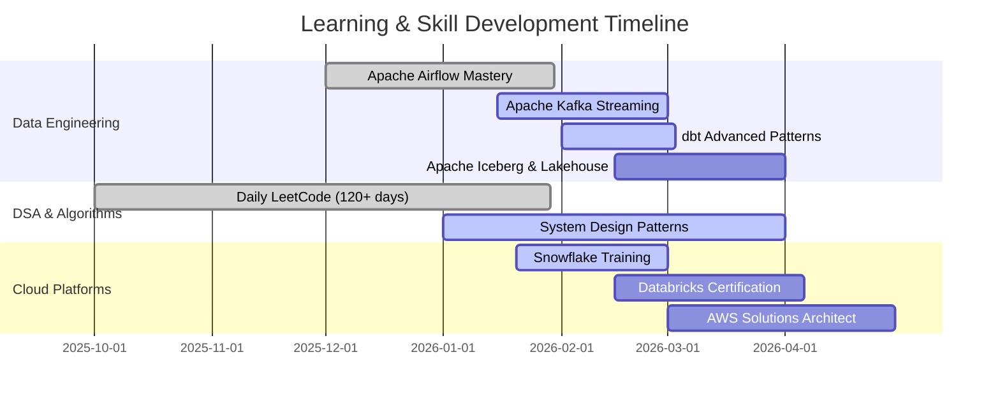

<div align="center">

<!-- Header Banner -->


<!-- Animated Typing -->
<a href="https://git.io/typing-svg"></a>

<!-- Social Badges - LARGER SIZE -->
<p align="center">
  <a href="https://linkedin.com/in/sumanth-malipeddi">
    
  </a>
  <a href="mailto:sumanth.9666@gmail.com">
    
  </a>
  <a href="https://x.com/Sumanth9666">
    
  </a>
  <a href="https://github.com/sumanthmalipeddi">
    
  </a>
</p>

<!-- Profile Stats -->
<p align="center">
  
  
  
</p>

</div>

---

## 📑 Table of Contents

<div align="center">

<table>
<tr>
<td align="center" width="20%">
<a href="#-open-to-opportunities">
<br/>
<b>🎯 Opportunities</b>
</a>
</td>
<td align="center" width="20%">
<a href="#-about-me">
<br/>
<b>👨‍💻 About Me</b>
</a>
</td>
<td align="center" width="20%">
<a href="#-learning-journey">
<br/>
<b>📚 Learning</b>
</a>
</td>
<td align="center" width="20%">
<a href="#-professional-experience">
<br/>
<b>💼 Experience</b>
</a>
</td>
<td align="center" width="20%">
<a href="#️-tech-stack">
<br/>
<b>🛠️ Tech Stack</b>
</a>
</td>
</tr>
<tr>
<td align="center" width="20%">
<a href="#-featured-projects">
<br/>
<b>🚀 Projects</b>
</a>
</td>
<td align="center" width="20%">
<a href="#-achievements--certifications">
<br/>
<b>🏆 Achievements</b>
</a>
</td>
<td align="center" width="20%">
<a href="#-education">
<br/>
<b>🎓 Education</b>
</a>
</td>
<td align="center" width="20%">
<a href="#-github-stats">
<br/>
<b>📊 GitHub Stats</b>
</a>
</td>
<td align="center" width="20%">
<a href="#-lets-connect">
<br/>
<b>📫 Connect</b>
</a>
</td>
</tr>
</table>

</div>

---

## 🎯 Open to Opportunities

<div align="center">

### Actively seeking AI Engineering, Data Engineering, and ML Engineering roles

<table>
<tr>
<td align="center" width="25%">
<h3>🤖 AI Engineer</h3>
<b>Primary Focus</b><br/><br/>
RAG Systems<br/>
Semantic Search<br/>
Vector Databases<br/>
LLM Integration<br/>
Prompt Engineering
</td>
<td align="center" width="25%">
<h3>🔧 Data Engineer</h3>
<b>Core Expertise</b><br/><br/>
ETL Pipelines<br/>
Lakehouse Architecture<br/>
Real-time Streaming<br/>
Data Quality<br/>
Orchestration
</td>
<td align="center" width="25%">
<h3>🤖 ML Engineer</h3>
<b>Experience</b><br/><br/>
Model Deployment<br/>
MLOps Pipelines<br/>
Feature Engineering<br/>
A/B Testing<br/>
Monitoring
</td>
<td align="center" width="25%">
<h3>📊 Data Scientist</h3>
<b>Skills</b><br/><br/>
Predictive Analytics<br/>
Statistical Modeling<br/>
NLP & Transformers<br/>
Experiment Design<br/>
Visualization
</td>
</tr>
</table>

**🎓 MS Data Science (9.5/10 CGPA) | 🔥 4+ Years Experience | 💼 Currently @ GetMySaas**

</div>

---

## 👨‍💻 About Me

<table>
<tr>
<td width="55%">

```yaml
name: Sumanth Malipeddi
role: Associate Data Science Engineer
company: GetMySaas
location: 📍 Tirupati, Andhra Pradesh, India
education: MS Data Science & AI | IISER Tirupati
gpa: 9.50/10 🏆
experience: 4+ years in data analytics & AI

core_expertise:
  primary: AI Engineering & RAG Systems
  domains:
    - Data Engineering (Airflow, Kafka, dbt, Iceberg)
    - Machine Learning (NLP, Transformers, MLOps)
    - Cloud Platforms (AWS, Databricks, Snowflake)
    - Databases (PostgreSQL, pgvector, Redis)

primary_tech_stack:
  languages: [Python, SQL]
  orchestration: Apache Airflow
  streaming: Apache Kafka
  cloud: [AWS, Databricks, Snowflake]
  transformation: [dbt, PySpark]
  ai_tools: [LangChain, pgvector, OpenSearch]

currently_building:
  - 15+ production Airflow DAGs
  - Kafka real-time streaming pipelines
  - Hybrid search (pgvector + OpenSearch)
  - RAG systems for LLM applications
  - Document intelligence workflows

philosophy: |
  "Production pipelines live in edge cases.
   Real learning happens when things break."
```

</td>
<td width="45%" align="center">


### 🔥 Learning Consistency

<table>
<tr>
<td align="center">
<br/>
<b>Language Learning</b>
</td>
</tr>
<tr>
<td align="center">
<br/>
<b>Math & CS</b>
</td>
</tr>
<tr>
<td align="center">
<br/>
<b>LeetCode Daily</b>
</td>
</tr>
</table>

### 💡 Fun Facts

```python
me = {
    "☕ Fuel": "Coffee + Claude AI",
    "🎵 Music": "Lo-fi beats",
    "📚 Style": "Build→Break→Learn",
    "🌟 Belief": "Every failure teaches",
    "🚀 Goal": "AI systems for future"
}
```

</td>
</tr>
</table>

---

## 📚 Learning Journey

<div align="center">

### 📖 Currently Reading & Completed Books

<table>
<tr>
<td width="33%" align="center">
<h4>📚 Fundamentals of Data Engineering</h4>
<i>Joe Reis & Matt Housley</i><br/><br/>
<br/><br/>
Finished all chapters including<br/>Security & Future of DE
</td>
<td width="33%" align="center">
<h4>📚 Hands-On Machine Learning</h4>
<i>Aurélien Géron</i><br/><br/>
<br/><br/>
Deep diving into ensemble methods<br/>and neural networks
</td>
<td width="33%" align="center">
<h4>📚 Designing Data-Intensive Apps</h4>
<i>Martin Kleppmann</i><br/><br/>
<br/><br/>
Starting with data models<br/>and query languages
</td>
</tr>
</table>

### 🗓️ 2026 Learning Roadmap



### 📝 Recent Learning Highlights

**Day 136** • Built custom PostgresToS3Operator with Airflow templating  
**Day 135** • Implemented Postgres → S3 → Docker Pandas ETL workflow  
**Day 134** • Solved maximum subarray with Kadane's Algorithm (O(n))  
**Day 131** • Dutch National Flag: 3-way partitioning in O(n)  
**Day 130** • Airflow branching with BranchPythonOperator  

</div>

---

## 💼 Professional Experience

### 🏢 **Associate Data Science Engineer** @ [GetMySaas](https://getmysaas.com)
*Oct 2025 - Present | Remote*

<div align="center">

```diff
# The Story: Fixing Broken Pipelines & Building AI Systems

! Problem: Manual data collection taking 40+ hours/week
! Problem: CSV NULL semantics causing pipeline failures
! Problem: No semantic search for unstructured documents

+ Solution: 15+ production Airflow DAGs automating everything
+ Solution: Custom operators handling CSV edge cases correctly
+ Solution: Hybrid search (pgvector + OpenSearch) for RAG systems

@@ Impact: 100% automation, 85% fewer incidents, 87% answer accuracy @@
```

</div>

#### 🚀 Key Contributions

<table>
<tr>
<td width="50%">

**🤖 AI Engineering**
```python
# RAG System Architecture
components = {
    'semantic': 'pgvector embeddings',
    'lexical': 'OpenSearch BM25',
    'hybrid': 'custom ranking algorithm',
    'accuracy': '87% answer quality'
}
```
- Built RAG pipelines connecting data to LLMs
- Document intelligence (Tika, Tesseract OCR)
- 10,000+ docs processed daily

</td>
<td width="50%">

**🔧 Data Engineering**
```python
# Lakehouse Pipeline
flow = [
    'Airbyte → S3 (Bronze)',
    'Iceberg → dbt (Silver/Gold)',
    'Trino → Query Layer'
]
impact = {
    'query_speedup': '70% faster',
    'analysts_enabled': '50+ users'
}
```
- 15+ Airflow DAGs orchestrating data
- Kafka streaming with Redis
- Great Expectations for quality

</td>
</tr>
</table>

**Tech Stack:** `Python` `SQL` `Apache Airflow` `Apache Kafka` `dbt` `Apache Iceberg` `PostgreSQL` `pgvector` `OpenSearch` `AWS` `Databricks` `Docker`

---

### 🎓 **Graduate Research Assistant** @ IISER Tirupati
*Aug 2024 - Aug 2025*

- **Transformer NLP Model**: 87% F1-score on financial sentiment analysis
- **Real-time ETL**: Kafka + Airflow pipeline with 60% time reduction
- **ML Applications**: 50GB+ datasets with 99.7% data integrity
- **A/B Testing**: 45% model performance improvement

---

## 🛠️ Tech Stack

<div align="center">

### 🎯 Primary Technologies

<table>
<tr>
<td align="center" width="12.5%">

<br><b>Python</b>
</td>
<td align="center" width="12.5%">

<br><b>SQL</b>
</td>
<td align="center" width="12.5%">

<br><b>Kafka</b>
</td>
<td align="center" width="12.5%">

<br><b>Databricks</b>
</td>
<td align="center" width="12.5%">

<br><b>dbt</b>
</td>
<td align="center" width="12.5%">

<br><b>PySpark</b>
</td>
<td align="center" width="12.5%">

<br><b>Snowflake</b>
</td>
<td align="center" width="12.5%">

<br><b>AWS</b>
</td>
</tr>
</table>

### 🔧 Complete Technology Arsenal

<table>
<tr>
<td align="center" width="25%">

#### 🤖 AI Engineering


</td>
<td align="center" width="25%">

#### 🔄 Data Engineering


</td>
<td align="center" width="25%">

#### 🤖 Machine Learning


</td>
<td align="center" width="25%">

#### ☁️ Cloud & Databases


</td>
</tr>
</table>

### 📊 Skill Hierarchy

<table>
<tr>
<td align="center" width="25%">
<h3>🎯 AI Engineering</h3>
<b>(Primary Focus)</b><br/><br/>
✦ RAG Systems<br/>
✦ Semantic Search<br/>
✦ Vector Databases<br/>
✦ LLM Integration<br/>
✦ Prompt Engineering
</td>
<td align="center" width="25%">
<h3>🔧 Data Engineering</h3>
<b>(Core Expertise)</b><br/><br/>
✦ Apache Airflow<br/>
✦ Apache Kafka<br/>
✦ dbt & Iceberg<br/>
✦ ETL Pipelines<br/>
✦ Data Quality
</td>
<td align="center" width="25%">
<h3>🤖 Machine Learning</h3>
<b>(Strong Skills)</b><br/><br/>
✦ NLP & Transformers<br/>
✦ MLOps & Deployment<br/>
✦ Feature Engineering<br/>
✦ Model Monitoring<br/>
✦ A/B Testing
</td>
<td align="center" width="25%">
<h3>☁️ Cloud & Databases</h3>
<b>(Advanced)</b><br/><br/>
✦ AWS & Databricks<br/>
✦ Snowflake<br/>
✦ PostgreSQL<br/>
✦ Redis & OpenSearch<br/>
✦ Docker
</td>
</tr>
</table>

</div>

---

## 🚀 Featured Projects

### 1️⃣ **Airbnb Data Pipeline: PostgreSQL → AWS S3** 

<div align="center">

[](https://github.com/sumanthmalipeddi/airflow-postgres-to-s3-pipeline)


**Production Apache Airflow 3.x pipeline with custom operators**

</div>

<table>
<tr>
<td width="50%" align="center">
<br/>
<b>Architecture Diagram</b>
</td>
<td width="50%" align="center">
<br/>
<b>Successful Execution</b>
</td>
</tr>
</table>

**🎯 Outcome:** 50,000+ records/day | 99.8% success rate | 45s runtime | Custom PostgresToS3Operator

**💻 Tech:** `Apache Airflow 3.x` `PostgreSQL` `AWS S3` `Python` `Docker`

---

### 2️⃣ **Wikipedia Pageviews Analytics Pipeline**

<div align="center">

[](https://github.com/sumanthmalipeddi/wiki-pipeline)

**Hourly ETL with distributed Celery processing**

</div>

<table>
<tr>
<td width="50%" align="center">
<br/>
<b>DAG Graph</b>
</td>
<td width="50%" align="center">
<br/>
<b>Workflow Success</b>
</td>
</tr>
</table>

**🎯 Outcome:** 39s full ETL | 24/7 operation | Distributed Celery processing

**💻 Tech:** `Airflow 3.1.5` `PostgreSQL 16` `Celery` `Redis` `Docker Compose`

---

### 3️⃣ **Spotify Trending Telugu Songs ETL**

<div align="center">

[](https://github.com/sumanthmalipeddi/spotify_trending_telugu)

<br/>
<b>Serverless Architecture</b>

</div>

**🎯 Outcome:** Serverless ETL | Automated daily collection

**💻 Tech:** `AWS Lambda` `Spotipy API` `S3` `CloudWatch`

---

### 4️⃣ **Skills & Resume Intelligence Analyzer**

<div align="center">

[](https://github.com/sumanthmalipeddi/llm_carrerasst)

**AI-powered resume analysis with NLP**

</div>

**🎯 Outcome:** 94.2% skill extraction | XGBoost salary prediction | ATS scoring

**💻 Tech:** `Streamlit` `spaCy` `XGBoost` `AWS EC2`

---

## 🏆 Achievements & Certifications

<div align="center">

<table>
<tr>
<th>🎓 Credential</th>
<th>🏢 Issuer</th>
<th>📅 Date</th>
<th>🔗 Link</th>
</tr>
<tr>
<td><b>MS Data Science & AI</b><br/>(CGPA: 9.50/10)</td>
<td>IISER Tirupati</td>
<td>Aug 2025</td>
<td>✅ Completed</td>
</tr>
<tr>
<td><b>Data Science, ML, DL, NLP Bootcamp</b></td>
<td>Udemy</td>
<td>Apr 2025</td>
<td><a href="https://udemy-certificate.s3.amazonaws.com/image/UC-04059c6b-c210-4409-bb19-1c1bdb005c16.jpg">View</a></td>
</tr>
<tr>
<td><b>Mathematics for DS & GenAI</b></td>
<td>Udemy</td>
<td>Oct 2024</td>
<td><a href="https://www.udemy.com/certificate/UC-385046d4-6cfd-475a-a4f3-557f1bd091f3/">View</a></td>
</tr>
<tr>
<td><b>AWS Cloud Practitioner</b></td>
<td>AWS</td>
<td>2024</td>
<td>✅ Completed</td>
</tr>
</table>

<br/>

### 🔥 Consistency Streaks


</div>

---

## 🎓 Education

<div align="center">

### 🏛️ Indian Institute of Science Education and Research (IISER) Tirupati

**Master of Science - Data Science & Artificial Intelligence**  
*Aug 2024 - Aug 2025*


</div>

<details>
<summary><b>📚 Click to view detailed coursework and projects</b></summary>

<br/>

**Core Courses:** Mathematics & Statistics • Data Structures & Algorithms • Database Systems • Machine Learning & Deep Learning • NLP & AI • Big Data Analytics • MLOps • Cloud Computing

**Major Projects:**
- Financial Sentiment Analysis (87% F1-score)
- Real-time ETL Pipeline (60% faster)
- Skills & Resume Analyzer (50GB+ data)
- A/B Testing Framework (45% improvement)

**Research:** Advanced ML for Predictive Analytics

</details>

---

<div align="center">

### 🏛️ SASTRA University

**Bachelor of Technology - Civil Engineering** | *2014 - 2018* | **CGPA: 8.542**

Foundation in mathematics, analytics, and data-driven problem solving

</div>

---

## 📊 GitHub Stats

<div align="center">

<table>
<tr>
<td align="center">

</td>
<td align="center">

</td>
</tr>
</table>

<br/>


<br/><br/>


</div>

---

## 📫 Let's Connect

<div align="center">


### 💬 Open to Collaborations, Mentorship, and Opportunities!

</div>

<table>
<tr>
<td align="center" width="25%">
<h3>💼 LinkedIn</h3>
<a href="https://linkedin.com/in/sumanth-malipeddi">
</a><br/><br/>
<b>2,300+ Followers</b><br/><br/>
Professional networking<br/>
Job opportunities<br/>
Technical discussions
</td>
<td align="center" width="25%">
<h3>💻 GitHub</h3>
<a href="https://github.com/sumanthmalipeddi">
</a><br/><br/>
<b>31+ Repositories</b><br/><br/>
Open source projects<br/>
Code collaborations<br/>
Technical reviews
</td>
<td align="center" width="25%">
<h3>📧 Email</h3>
<a href="mailto:sumanth.9666@gmail.com">
</a><br/><br/>
<b>Direct Contact</b><br/><br/>
Project collaborations<br/>
Mentorship requests<br/>
Consulting inquiries
</td>
<td align="center" width="25%">
<h3>🐦 Twitter</h3>
<a href="https://x.com/Sumanth9666">
</a><br/><br/>
<b>Tech Updates</b><br/><br/>
Learning journey<br/>
Industry insights<br/>
Quick discussions
</td>
</tr>
</table>

---

<div align="center">

### 📊 Profile Highlights


---

### 🎯 What I'm Looking For

✅ **AI/ML Engineering roles** at innovative product companies  
✅ **Data Engineering positions** with modern stack (Airflow, Kafka, dbt)  
✅ **Research collaborations** in RAG and semantic search  
✅ **Mentorship opportunities** for aspiring data professionals  
✅ **Open-source contributions** in AI/data engineering  

</div>

---

<div align="center">


### ⭐ If you find my work valuable, star my repositories!


### © 2026 Sumanth Malipeddi | Building AI systems one pipeline at a time 🚀

**"The best way to predict the future is to build it with data and AI."**

<sub>Last updated: February 2026</sub>

</div>
