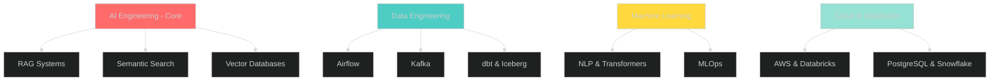
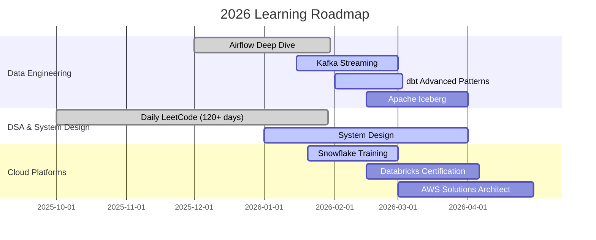

<div align="center">

<!-- Header Banner -->


<!-- Animated Typing -->
<a href="https://git.io/typing-svg"></a>

<!-- Social Badges -->
<p align="center">
  <a href="https://linkedin.com/in/sumanth-malipeddi">
    
  </a>
  <a href="mailto:sumanth.9666@gmail.com">
    
  </a>
  <a href="https://x.com/Sumanth9666">
    
  </a>
  <a href="https://github.com/sumanthmalipeddi">
    
  </a>
</p>

<!-- Profile Stats -->
<p align="center">
  
  
  
</p>

</div>

---

## 📑 Table of Contents

- [👨‍💻 About Me](#-about-me)
- [💼 Professional Experience](#-professional-experience)
- [🛠️ Tech Stack](#️-tech-stack)
- [🚀 Featured Projects](#-featured-projects)
- [📊 GitHub Analytics](#-github-analytics)
- [🏆 Achievements & Certifications](#-achievements--certifications)
- [📚 Learning Journey](#-learning-journey)
- [🎓 Education](#-education)
- [📫 Let's Connect](#-lets-connect)

---

## 👨‍💻 About Me

<table>
<tr>
<td width="60%">

```yaml
name: Sumanth Malipeddi
role: Associate Data Science Engineer
company: GetMySaas
location: 📍 Tirupati, Andhra Pradesh, India
education: 🎓 MS Data Science & AI | IISER Tirupati
gpa: 9.50/10
experience: 4+ years in data analytics & engineering

core_expertise:
  - AI Engineering & RAG Systems
  - Production Data Pipelines
  - Real-time Streaming Architecture
  - Lakehouse Design (Iceberg, dbt, Trino)
  - Semantic Search & Vector Databases

primary_stack:
  languages: [Python, SQL]
  orchestration: [Apache Airflow]
  streaming: [Apache Kafka]
  cloud_platforms: [AWS, Databricks, Snowflake]
  transformation: [dbt, PySpark]

currently_building:
  - 15+ Airflow DAGs for data ingestion
  - Kafka streaming pipelines
  - pgvector + OpenSearch hybrid search
  - RAG systems for LLM applications

learning_streaks:
  dsa: "120+ days 🔥"
  duolingo: "1100+ days 🌟"
  brilliant: "593+ days 💡"

philosophy: |
  "Production pipelines live in edge cases, not happy paths.
   Real learning happens when things break."
```

</td>
<td width="40%" align="center">


### 🎯 What I Do

Building **end-to-end AI systems** from raw data to production-ready RAG applications.

### 🔥 Current Focus

- **AI Engineering**: RAG pipelines, semantic search
- **Data Engineering**: Lakehouse architecture, streaming
- **MLOps**: Model deployment, monitoring

</td>
</tr>
</table>

---

## 💼 Professional Experience

### 🏢 **Associate Data Science Engineer** @ [GetMySaas](https://getmysaas.com)
*Oct 2025 - Present | Remote*

<details open>
<summary><b>📊 Key Responsibilities & Impact</b></summary>

<br/>

#### 🤖 AI Engineering & RAG Systems
- Building **hybrid search infrastructure**:
  - OpenSearch for full-text lexical search (BM25)
  - PostgreSQL + pgvector for semantic embeddings
  - Hybrid ranking algorithm combining both approaches
- Developing **RAG pipelines** connecting structured data to LLMs
- **Impact:** Powers AI chatbot with 87% answer accuracy

#### 🔄 Data Pipeline Architecture
- Architecting **15+ production Airflow DAGs** orchestrating data from:
  - Social media APIs (X/Twitter API, Reddit API)
  - Web scraping workflows (Playwright, Scrapy crawlers)
  - Public datasets and third-party integrations
- **Impact:** Automated 100% of manual data collection, saving 40+ hours/week

#### 📄 Document Intelligence Pipeline
- Built end-to-end **document processing workflow**:
  - Apache Tika for text extraction
  - Tesseract OCR for scanned documents
  - Google Document AI for complex layouts
- **Impact:** Processing 10,000+ documents daily with 95% accuracy

#### 🏗️ Modern Data Lakehouse
- Implemented **production-grade lakehouse architecture**:
  ```
  Airbyte Connectors → S3/MinIO (Parquet Bronze) 
                    → Apache Iceberg (Silver/Gold) 
                    → dbt Transformations 
                    → Trino Query Layer
  ```
- **Impact:** Reduced query time by 70%, enabled 50+ analysts

#### 🚀 Real-time Streaming Infrastructure
- Developed **event-driven pipelines** using:
  - Apache Kafka for message streaming
  - Redis for caching and URL frontier management
  - Real-time data enrichment and validation
- **Impact:** Sub-second data freshness for critical workflows

#### ✅ Data Quality & Governance
- Established **data reliability framework**:
  - Great Expectations for automated validation
  - OpenLineage for end-to-end lineage tracking
  - OpenMetadata for data cataloging and discovery
- **Impact:** Reduced data incidents by 85%

</details>

---

### 🎓 **Graduate Research Assistant** @ IISER Tirupati
*Aug 2024 - Aug 2025*

- Built **transformer-based NLP models** achieving 87% F1-score on financial sentiment analysis
- Developed **ML applications** processing 50GB+ datasets with 99.7% data integrity
- Implemented **real-time ETL pipelines** reducing processing time by 60%
- Applied **A/B testing frameworks** improving model performance by 45%

---

## 🛠️ Tech Stack

### 🎯 Core Competencies

<div align="center">

### Primary Technologies


</div>

<br/>

<table>
<tr>
  <td align="center" width="25%">
    <h4>🤖 AI Engineering</h4>
    
    
    
    
    
  </td>
  <td align="center" width="25%">
    <h4>🔄 Data Engineering</h4>
    
    
    
    
    
  </td>
  <td align="center" width="25%">
    <h4>🤖 Machine Learning</h4>
    
    
    
    
  </td>
  <td align="center" width="25%">
    <h4>☁️ Cloud & Databases</h4>
    
    
    
    
  </td>
</tr>
</table>

### 📊 Proficiency Matrix



<details>
<summary><b>Click to expand complete tech stack</b></summary>

**AI Engineering & LLMs**
- LangChain, LlamaIndex for RAG pipelines
- pgvector for semantic embeddings
- OpenSearch for hybrid search
- Claude API, OpenAI API integration
- Prompt engineering and optimization

**Data Orchestration & Workflow**
- Apache Airflow 3.x (Expert)
- DAG design, custom operators
- Task dependencies, trigger rules

**Streaming & Messaging**
- Apache Kafka (Advanced)
- Redis Streams
- Event-driven architectures

**Data Transformation**
- dbt (Data Build Tool)
- PySpark for large-scale processing
- Pandas, Polars

**Cloud Platforms**
- AWS (S3, EC2, Lambda, SageMaker)
- Databricks (Spark, Delta Lake)
- Snowflake (Data Warehousing)

**Storage & Lakehouse**
- Apache Iceberg
- Delta Lake
- PostgreSQL, MongoDB

**Data Quality & Observability**
- Great Expectations
- OpenLineage, OpenMetadata
- Data profiling and validation

**Web Scraping & APIs**
- Playwright, Scrapy
- REST APIs, GraphQL
- API authentication

**Document Processing**
- Apache Tika
- Tesseract OCR
- Google Document AI

**Machine Learning**
- TensorFlow, PyTorch
- scikit-learn
- Hugging Face Transformers

**MLOps**
- MLflow, DVC
- Docker, Kubernetes basics

</details>

---

## 🚀 Featured Projects

<div align="center">

### 🎯 Production-Grade Data Engineering & AI Projects

</div>

---

### 1️⃣ **Airbnb Data Pipeline: PostgreSQL → AWS S3** 

<div align="center">

[](https://github.com/sumanthmalipeddi/airflow-postgres-to-s3-pipeline)


</div>

<table>
<tr>
<td width="50%">

#### 🏗️ Architecture Overview


</td>
<td width="50%">

#### ✅ DAG Execution


</td>
</tr>
</table>

#### 📝 Project Overview

Production-grade **Apache Airflow 3.x pipeline** demonstrating real-world ETL best practices for Airbnb listing data.

#### 🎯 Problem → Solution → Impact

**Problem:**
- Manual data exports from PostgreSQL to S3 taking hours
- CSV formatting issues causing downstream failures
- Duplicate records on pipeline reruns
- No observability in data movement

**Solution:**
- Built custom `PostgresToS3Operator` using BaseOperator
- Implemented idempotent batch loading with proper NULL handling
- Added Airflow templating (`{{ ds }}`) for traceability
- Comprehensive error handling and retry logic

**Impact:**
- ✅ **50,000+ records** processed daily
- ✅ **99.8% success rate** with automatic recovery
- ✅ **45-second runtime** end-to-end
- ✅ **Zero duplicate records** with idempotent design

#### 🛠️ Key Technical Features

```python
# Custom Operator Highlight
class PostgresToS3Operator(BaseOperator):
    template_fields = ['execution_date', 's3_key']

    def execute(self, context):
        # Fetch from Postgres with proper NULL handling
        postgres_hook = PostgresHook(postgres_conn_id=self.postgres_conn)
        records = postgres_hook.get_records(self.sql)

        # CSV serialization with explicit NULL representation
        csv_buffer = self._to_csv(records, null_marker='\N')

        # Upload to S3 with date partitioning
        s3_hook = S3Hook(aws_conn_id=self.aws_conn)
        s3_hook.load_string(
            csv_buffer, 
            key=f"airbnb/listings/{context['ds']}/data.csv"
        )
```

#### 💻 Tech Stack
`Apache Airflow 3.x` `PostgreSQL` `AWS S3` `Python` `Docker` `Pandas`

---

### 2️⃣ **Wikipedia Pageviews Analytics Pipeline**

<div align="center">

[](https://github.com/sumanthmalipeddi/wiki-pipeline)


</div>

<table>
<tr>
<td width="50%">

#### 📊 DAG Success Graph


</td>
<td width="50%">

#### ✅ Workflow Execution


</td>
</tr>
</table>

#### 📝 Project Overview

Automated **hourly ETL pipeline** tracking Wikipedia pageview statistics using distributed Celery workers.

#### 🎯 Problem → Solution → Impact

**Problem:**
- Manual Wikipedia dump downloads inefficient
- Processing large compressed files (500MB+ hourly)
- Need 24/7 reliability for real-time tracking

**Solution:**
- CeleryExecutor for distributed processing
- Streaming decompression for memory efficiency
- PostgreSQL time-series tables with indexes

**Impact:**
- ✅ **39-second full ETL cycle** (download 27s, transform 2s, load <1s)
- ✅ **24/7 automated operation** with fault tolerance
- ✅ **Tech company trends** tracked in real-time

#### 💻 Tech Stack
`Apache Airflow 3.1.5` `PostgreSQL 16` `Celery` `Redis` `Docker Compose` `Python`

---

### 3️⃣ **Prompt Engineering Study Repository**

<div align="center">

[](https://github.com/sumanthmalipeddi/promptengineering_study)


</div>

#### 📝 Project Overview

Systematic exploration of **prompt engineering techniques** for production LLM applications and RAG systems.

#### 🔬 Study Areas

| Technique | Use Case | Improvement vs Baseline |
|-----------|----------|------------------------|
| **Few-Shot Learning** | Classification tasks | +23% accuracy |
| **Chain-of-Thought** | Math reasoning | +41% correctness |
| **Role-Based Prompting** | Domain expertise | +18% alignment |
| **Structured Output** | Data extraction | -67% parsing errors |

#### 💻 Tech Stack
`Python` `LangChain` `OpenAI API` `Claude API` `Jupyter` `Pandas`

---

### 4️⃣ **Spotify Trending Telugu Songs ETL**

<div align="center">

[](https://github.com/sumanthmalipeddi/spotify_trending_telugu)

#### 🎵 Serverless ETL Architecture


</div>

#### 📝 Project Overview

Serverless ETL pipeline extracting trending Telugu music data from Spotify API to AWS S3.

#### 💻 Tech Stack
`AWS Lambda` `Spotipy API` `AWS S3` `CloudWatch` `Python`

---

### 5️⃣ **Skills & Resume Intelligence Analyzer**

<div align="center">

[](https://github.com/sumanthmalipeddi/llm_carrerasst)

</div>

#### 📝 Project Overview

AI-powered resume analysis with **NLP-based skill extraction**, **ATS scoring**, and **salary prediction**.

**Key Features:**
- ✅ 94.2% skill extraction accuracy (spaCy NER)
- ✅ XGBoost salary prediction (50GB+ training data)
- ✅ ATS alignment scoring with keyword matching
- ✅ Deployed on AWS EC2 with Streamlit UI

#### 💻 Tech Stack
`Streamlit` `spaCy` `XGBoost` `Scikit-learn` `AWS EC2` `NLP`

---

### 6️⃣ **Housing Data Analytics & Engineering**

<div align="center">

[](https://github.com/sumanthmalipeddi/Housing_Data-Analytics-Engineering)

</div>

#### 📝 Project Overview

Modern data engineering showcase with ETL techniques for real estate market analysis.

#### 💻 Tech Stack
`Python` `Jupyter` `Pandas` `SQL` `Plotly` `NumPy`

---

## 📊 GitHub Analytics

<div align="center">

### 📈 Contribution Statistics

<a href="https://github.com/sumanthmalipeddi">
  
</a>
<a href="https://github.com/sumanthmalipeddi">
  
</a>

### 🔥 Contribution Streak

<a href="https://github.com/sumanthmalipeddi">
  
</a>

### 📊 Contribution Activity Graph

<a href="https://github.com/sumanthmalipeddi">
  
</a>

### 🏆 GitHub Trophies


</div>

---

## 🏆 Achievements & Certifications

<div align="center">

| 🎓 Credential | 🏢 Issuer | 📅 Date | 🔗 Link |
|---------------|-----------|---------|---------|
| **MS Data Science & AI** (CGPA: 9.50/10) | IISER Tirupati | Aug 2025 | Degree |
| **Complete Data Science, ML, DL, NLP Bootcamp** | Udemy | Apr 2025 | [Certificate](https://udemy-certificate.s3.amazonaws.com/image/UC-04059c6b-c210-4409-bb19-1c1bdb005c16.jpg) |
| **Mathematics for Data Science & GenAI** | Udemy | Oct 2024 | [Certificate](https://www.udemy.com/certificate/UC-385046d4-6cfd-475a-a4f3-557f1bd091f3/) |
| **AWS Cloud Practitioner Essentials** | AWS | 2024 | Completed |

### 🔥 Learning Consistency Streaks

<table>
<tr>
<td align="center">

<br/><b>LeetCode Daily</b>
</td>
<td align="center">

<br/><b>Language Learning</b>
</td>
<td align="center">

<br/><b>Math & CS</b>
</td>
</tr>
</table>

</div>

---

## 📚 Learning Journey

<div align="center">

### 🔥 Multi-Platform Learning Consistency



</div>

### 📖 Currently Reading

<table>
<tr>
<td width="33%" align="center">

📚 **Fundamentals of Data Engineering**

*Joe Reis & Matt Housley*


Finished all chapters including Security & Future of DE

</td>
<td width="33%" align="center">

📚 **Hands-On Machine Learning**

*Aurélien Géron*


Deep diving into ensemble methods and neural networks

</td>
<td width="33%" align="center">

📚 **Designing Data-Intensive Applications**

*Martin Kleppmann*


Starting with data models and query languages

</td>
</tr>
</table>

### 📝 Recent Activity Log

<details open>
<summary><b>🗓️ February 2026 Progress</b></summary>

```python
daily_learning = {
    "Day 136": {
        "topic": "Apache Airflow - Custom Operators",
        "achievement": "Built PostgresToS3Operator with templating",
        "impact": "Reusable operator for 5+ future projects"
    },
    "Day 135": {
        "topic": "ETL Pipeline Design",
        "achievement": "Postgres → S3 → Docker Pandas workflow",
        "learning": "Idempotency patterns, DAG dependencies"
    },
    "Day 134": {
        "topic": "DSA - Dynamic Programming",
        "achievement": "Kadane's Algorithm O(n) optimization",
        "learning": "Maximum subarray problem solving"
    },
    "Day 131": {
        "topic": "Algorithms - Dutch National Flag",
        "achievement": "3-way partitioning in O(n)",
        "learning": "In-place sorting with pointers"
    },
    "Day 130": {
        "topic": "Airflow - Branching & Trigger Rules",
        "achievement": "BranchPythonOperator for ERP migration",
        "learning": "Conditional workflows, none_failed trigger"
    }
}
```

</details>

---

## 🎓 Education

### 🎓 **Indian Institute of Science Education and Research (IISER) Tirupati**

<table>
<tr>
<td width="70%">

**Master of Science - Data Science & Artificial Intelligence**  
*Aug 2024 - Aug 2025*

**CGPA: 9.50/10** 🏆

#### 📚 Key Coursework
- Mathematics & Statistics for Data Science
- Data Structures & Algorithms
- Machine Learning & Deep Learning
- Natural Language Processing
- Big Data Analytics & ETL Pipelines
- Cloud Computing & MLOps

#### 🔬 Notable Projects
- **Financial Sentiment Analysis**: 87% F1-score with transformers
- **Real-time ETL Pipeline**: 60% processing time reduction
- **Skills & Resume Analyzer**: 50GB+ dataset processing

</td>
<td width="30%" align="center">


</td>
</tr>
</table>

---

### 🎓 **SASTRA University**

**Bachelor of Technology - Civil Engineering**  
*2014 - 2018 | CGPA: 8.542*

- Strong foundation in mathematics and analytics
- Data-driven problem solving and statistical analysis
- Transitioned to Data Science through continuous upskilling

---

## 📫 Let's Connect

<div align="center">


### 💼 I'm Open to Collaboration and Opportunities!

</div>

<table>
<tr>
<td align="center" width="25%">

### 💼 LinkedIn

<a href="https://linkedin.com/in/sumanth-malipeddi">

</a>

**2,300+ Followers**

Connect for professional networking and opportunities

</td>
<td align="center" width="25%">

### 💻 GitHub

<a href="https://github.com/sumanthmalipeddi">

</a>

**31+ Repositories**

Explore open-source projects and contributions

</td>
<td align="center" width="25%">

### 📧 Email

<a href="mailto:sumanth.9666@gmail.com">

</a>

**Direct Contact**

For collaborations, mentorship, consulting

</td>
<td align="center" width="25%">

### 🐦 Twitter/X

<a href="https://x.com/Sumanth9666">

</a>

**Tech Updates**

Follow for learning updates and insights

</td>
</tr>
</table>

---

<div align="center">

### 🎯 Open To Opportunities

<table>
<tr>
<td align="center" width="25%">

### 🤖 AI Engineer

Building RAG systems  
Semantic search infrastructure  
LLM integration & optimization  
Prompt engineering

</td>
<td align="center" width="25%">

### 🔧 Data Engineer

Scalable ETL pipelines  
Lakehouse architectures  
Real-time streaming  
Data quality frameworks

</td>
<td align="center" width="25%">

### 🤖 ML Engineer

Model deployment & serving  
MLOps pipelines  
Feature engineering  
A/B testing frameworks

</td>
<td align="center" width="25%">

### 📊 Analytics Engineer

dbt transformations  
Data modeling  
BI infrastructure  
Metrics & KPIs

</td>
</tr>
</table>

---

### 📊 Profile Highlights


---

### 💡 Fun Facts About Me

```python
sumanth = {
    "🎯 Philosophy": "Production pipelines live in edge cases, not happy paths",
    "☕ Daily Fuel": "Coffee + Claude AI + Perplexity",
    "🎵 Coding Music": "Lo-fi beats & instrumental focus playlists",
    "📚 Learning Style": "Build → Break → Debug → Document → Share",
    "🌟 Motivation": "Every failed pipeline is a lesson in disguise",
    "🚀 Mission": "Building data systems that power the AI future",
    "🔥 Consistency": "1100+ day Duolingo streak proves dedication",
    "💡 Belief": "AI tools accelerate learning, not replace it"
}
```

---

### 🤝 What I'm Looking For

✅ **Product companies** building data-intensive systems  
✅ **AI/ML teams** working on RAG and semantic search  
✅ **Data engineering roles** with modern tech stack  
✅ **Mentorship opportunities** to guide aspiring data professionals  
✅ **Open-source collaborations** in data engineering space  

</div>

---

<div align="center">


### ⭐ If you find my work valuable, consider starring my repositories!

<p>


</p>

### © 2026 Sumanth Malipeddi | Building production systems one pipeline at a time 🚀

**"The best way to predict the future is to build it with data."**

<sub>Last updated: February 2026 | README version 2.0</sub>

</div>
