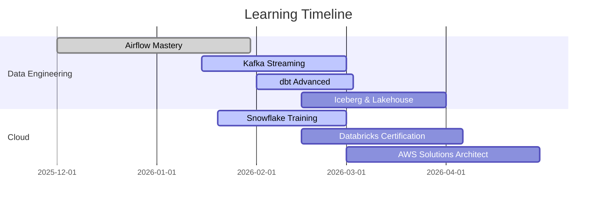

<div align="center">

<!-- Animated Header -->


<!-- Typing Animation - Fixed sizing -->
<a href="https://git.io/typing-svg">
  
</a>

<br/>

<!-- Social Links - Clean flat style -->
[](https://linkedin.com/in/sumanth-malipeddi)
[](mailto:sumanth.9666@gmail.com)
[](https://x.com/Sumanth9666)
[](https://github.com/sumanthmalipeddi)


</div>

<div align="center">

| &nbsp;&nbsp;&nbsp;[👨‍💻 About](#-about-me)&nbsp;&nbsp;&nbsp; | &nbsp;&nbsp;&nbsp;[🛠️ Tech](#%EF%B8%8F-tech-stack)&nbsp;&nbsp;&nbsp; | &nbsp;&nbsp;&nbsp;[💼 Experience](#-professional-experience)&nbsp;&nbsp;&nbsp; | &nbsp;&nbsp;&nbsp;[📚 Learning](#-learning-journey)&nbsp;&nbsp;&nbsp; | &nbsp;&nbsp;&nbsp;[🚀 Projects](#-featured-projects)&nbsp;&nbsp;&nbsp; | &nbsp;&nbsp;&nbsp;[📫 Connect](#-lets-connect)&nbsp;&nbsp;&nbsp; |
|:---:|:---:|:---:|:---:|:---:|:---:|

</div>

---

## 👨‍💻 About Me

```typescript
const sumanth = {
    role: "Associate Data Science Engineer",
    company: "GetMySaas",
    location: "Tirupati, India",
    education: "MS Data Science & AI | IISER Tirupati | 9.5 CGPA",
    
    expertise: {
        primary: "AI Engineering & RAG Systems",
        domains: [
            "Data Engineering (Airflow, Kafka, dbt, Iceberg)",
            "Machine Learning (NLP, Transformers, MLOps)",
            "Cloud Platforms (AWS, Databricks, Snowflake)"
        ]
    },
    
    currentlyBuilding: [
        "15+ production Airflow DAGs",
        "Kafka real-time streaming pipelines",
        "Hybrid search (pgvector + OpenSearch)",
        "RAG systems for LLM applications"
    ],
    
    askMeAbout: [
        "Data pipelines", "RAG systems", "Vector databases",
        "ETL/ELT", "Data lakehouse", "ML deployment"
    ],
    
    funFact: "I've maintained 1100+ day streaks on Duolingo 🦉"
};
```


### 🔥 Learning Consistency

```text
🦉 Duolingo      1100+ days  ████████████████████  German
🧠 Brilliant      593+ days  ████████████████░░░░  Math & CS
💻 LeetCode       120+ days  ████████░░░░░░░░░░░░  DSA Daily
```

### 💡 Quick Facts

| | |
|:--|:--|
| 🥤 **Fuel** | Protein + Claude AI |
| 🎵 **Codes to** | Lo-fi beats |
| 📚 **Style** | Build → Break → Learn |
| 🌟 **Belief** | Every failure teaches |

### 💬 Philosophy

> *"Production pipelines live in edge cases. Real learning happens when things break."*

<br clear="right"/>

---

## 🛠️ Tech Stack

<div align="center">

**Languages & Core**


**Data Engineering**


**Cloud & Platforms**


**AI/ML & Databases**


</div>

---

## 💼 Professional Experience

### 🏢 Associate Data Science Engineer @ [GetMySaas](https://getmysaas.com)
<sub>Oct 2025 - Present • Remote</sub>


**The Challenge:**
```diff
- Manual data collection: 40+ hours/week
- CSV NULL handling: Silent pipeline failures
- Document search: Zero semantic capabilities
- Data freshness: Analysts waiting days
```

**The Solution I Built:**
```diff
+ 15+ Airflow DAGs → 100% automation
+ Custom operators → 85% fewer incidents  
+ Hybrid search → 87% answer accuracy
+ Kafka streaming → Data in minutes
```

<br clear="right"/>

#### 📊 Impact Metrics

| Area | Achievement |
|:-----|:------------|
| **AI Engineering** | RAG pipeline with 87% accuracy, 10K+ docs/day, <200ms latency |
| **Data Engineering** | Lakehouse architecture (Bronze→Silver→Gold), 70% faster queries |
| **Infrastructure** | 15+ DAGs, Kafka streaming, Great Expectations quality gates |

**Tech:** `Python` `Airflow` `Kafka` `dbt` `Iceberg` `pgvector` `OpenSearch` `AWS` `Databricks`

---

### 🎓 MS Research @ IISER Tirupati
<sub>Aug 2024 - Aug 2025 • Master of Science in Data Science & AI</sub>

| Project | Impact |
|:--------|:-------|
| Transformer NLP Model | **87% F1-score** on financial sentiment |
| Real-time ETL Pipeline | **60% time reduction** with Kafka + Airflow |
| ML Data Processing | **50GB+ datasets**, 99.7% integrity |
| A/B Testing Framework | **45% model improvement** |

---

## 📚 Learning Journey

### 📖 Currently Reading

| Book | Author | Status |
|:-----|:-------|:------:|
| Fundamentals of Data Engineering | Joe Reis & Matt Housley | ✅ Completed |
| Hands-On Machine Learning | Aurélien Géron | 📖 In Progress |
| Designing Data-Intensive Apps | Martin Kleppmann | 🆕 Started |

### 🗓️ 2026 Roadmap



---

## 🚀 Featured Projects

<table>
<tr>
<td width="50%">

### 📦 Airbnb → S3 Pipeline
[](https://github.com/sumanthmalipeddi/airflow-postgres-to-s3-pipeline)

Production Airflow 3.x with custom operators

- **50,000+ records/day** processed
- **99.8% success rate**
- **45 second** runtime
- Custom `PostgresToS3Operator`

`Airflow` `PostgreSQL` `AWS S3` `Docker`

</td>
<td width="50%">

### 📊 Wikipedia Analytics
[](https://github.com/sumanthmalipeddi/wiki-pipeline)

Hourly ETL with distributed Celery

- **39 second** full ETL cycle
- **24/7** operation
- Distributed processing
- `Celery + Redis` workers

`Airflow` `PostgreSQL` `Celery` `Redis`

</td>
</tr>
<tr>
<td width="50%">

### 🎵 Spotify Telugu ETL
[](https://github.com/sumanthmalipeddi/spotify_trending_telugu)

Serverless daily music collection

- **AWS Lambda** serverless
- **Daily automated** collection
- **S3** storage
- `CloudWatch` monitoring

`Lambda` `Spotipy` `S3` `CloudWatch`

</td>
<td width="50%">

### 📄 Resume Analyzer
[](https://github.com/sumanthmalipeddi/llm_carrerasst)

AI-powered career intelligence

- **94.2%** skill extraction
- **XGBoost** salary prediction
- **ATS scoring** automated
- `Streamlit` interface

`Streamlit` `spaCy` `XGBoost` `EC2`

</td>
</tr>
</table>

---

## 🎓 Education

<table>
<tr>
<td width="70%">

### 🏛️ IISER Tirupati
**Master of Science - Data Science & Artificial Intelligence**

Aug 2024 - Aug 2025

**Coursework:** ML/DL • NLP • Big Data • MLOps • Cloud Computing • Statistics

**Research:** Advanced ML for Predictive Analytics

</td>
<td width="30%" align="center">

**CGPA**
### 9.50/10
**Top 1%**

</td>
</tr>
</table>

**🏛️ SASTRA University** • B.Tech Civil Engineering • 2014-2018 • CGPA: 8.542

---

## 🏆 Certifications

| Credential | Issuer | Year |
|:-----------|:-------|:----:|
| MS Data Science & AI (9.50 CGPA) | IISER Tirupati | 2025 |
| Data Science, ML, DL, NLP Bootcamp | Udemy | 2025 |
| Mathematics for DS & GenAI | Udemy | 2024 |
| AWS Cloud Practitioner | AWS | 2024 |

---

## 📫 Let's Connect

<div align="center">


| Platform | Link | Details |
|:--------:|:----:|:--------|
| 💼 LinkedIn | [Connect](https://linkedin.com/in/sumanth-malipeddi) | 2,300+ followers |
| 💻 GitHub | [Follow](https://github.com/sumanthmalipeddi) | 31+ repositories |
| 📧 Email | [Contact](mailto:sumanth.9666@gmail.com) | Direct inquiries |
| 🐦 Twitter | [Follow](https://x.com/Sumanth9666) | Tech updates |

### 🎯 Looking For

✅ **AI/ML Engineering** at innovative product companies  
✅ **Data Engineering** with modern stack (Airflow, Kafka, dbt)  
✅ **Research collaborations** in RAG and semantic search

</div>

---

<div align="center">


*"The best way to predict the future is to build it with data and AI."*

**© 2025 Sumanth Malipeddi** • Building AI systems one pipeline at a time 🚀

</div>
