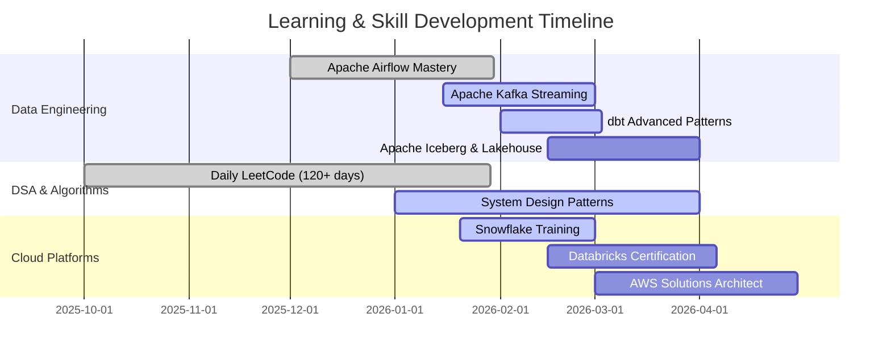

<div align="center">

<!-- Header Banner -->


<!-- Animated Typing -->
<a href="https://git.io/typing-svg"></a>

<!-- Social Badges - LARGER SIZE with proper dimensions -->
<p align="center">
  <a href="https://linkedin.com/in/sumanth-malipeddi">
    
  </a>&nbsp;
  <a href="mailto:sumanth.9666@gmail.com">
    
  </a>&nbsp;
  <a href="https://x.com/Sumanth9666">
    
  </a>&nbsp;
  <a href="https://github.com/sumanthmalipeddi">
    
  </a>
</p>

<!-- Profile Stats - Larger -->
<p align="center">
  
  &nbsp;
  
  &nbsp;
  
</p>

</div>

---

## 🧭 Navigation

<div align="center">

<table>
<tr>
<td align="center" width="14%">
<a href="#-learning-journey">
<br/>
<b>📚 Learning</b>
</a>
</td>
<td align="center" width="14%">
<a href="#-professional-experience">
<br/>
<b>💼 Experience</b>
</a>
</td>
<td align="center" width="14%">
<a href="#️-tech-arsenal">
<br/>
<b>🛠️ Tech Stack</b>
</a>
</td>
<td align="center" width="14%">
<a href="#-featured-projects">
<br/>
<b>🚀 Projects</b>
</a>
</td>
<td align="center" width="14%">
<a href="#-achievements">
<br/>
<b>🏆 Achievements</b>
</a>
</td>
<td align="center" width="14%">
<a href="#-education">
<br/>
<b>🎓 Education</b>
</a>
</td>
<td align="center" width="14%">
<a href="#-lets-connect">
<br/>
<b>📫 Connect</b>
</a>
</td>
</tr>
</table>

</div>

---

## 📚 Learning Journey

<div align="center">

### 🔥 Consistency Speaks Louder Than Words

<table>
<tr>
<td align="center" width="33%">
<br/><br/>
<br/>
<b>Language Learning</b><br/>
<sub>Daily German Practice</sub>
</td>
<td align="center" width="33%">
<br/><br/>
<br/>
<b>Brilliant</b><br/>
<sub>Math & CS Fundamentals</sub>
</td>
<td align="center" width="33%">
<br/><br/>
<br/>
<b>LeetCode Daily</b><br/>
<sub>DSA Practice</sub>
</td>
</tr>
</table>

### 📖 Currently Reading

<table>
<tr>
<td align="center" width="33%">
<h4>📘 Fundamentals of Data Engineering</h4>
<i>Joe Reis & Matt Housley</i><br/><br/>

</td>
<td align="center" width="33%">
<h4>📗 Hands-On Machine Learning</h4>
<i>Aurélien Géron</i><br/><br/>

</td>
<td align="center" width="33%">
<h4>📙 Designing Data-Intensive Apps</h4>
<i>Martin Kleppmann</i><br/><br/>

</td>
</tr>
</table>

### 🗓️ 2026 Roadmap



<details>
<summary><b>📝 Recent Learning Log (Click to expand)</b></summary>
<br/>

| Day | Topic | Key Learning |
|:---:|-------|--------------|
| 136 | Airflow | Built custom PostgresToS3Operator with templating |
| 135 | ETL | Implemented Postgres → S3 → Docker Pandas workflow |
| 134 | DSA | Maximum subarray with Kadane's Algorithm O(n) |
| 131 | DSA | Dutch National Flag: 3-way partitioning O(n) |
| 130 | Airflow | Branching with BranchPythonOperator |

</details>

</div>

---

## 👨‍💻 About Me

<table>
<tr>
<td width="55%">

```yaml
name: Sumanth Malipeddi
role: Associate Data Science Engineer
company: GetMySaas
location: 📍 Tirupati, India
education: MS Data Science | IISER Tirupati
gpa: 9.50/10 🏆
experience: 4+ years

expertise:
  primary: AI Engineering & RAG Systems
  domains:
    - Data Engineering
    - Machine Learning
    - Cloud Platforms

philosophy: |
  "Production pipelines live in edge cases.
   Real learning happens when things break."
```

</td>
<td width="45%" align="center">


### 💡 Fun Facts

```python
me = {
    "☕ Fuel": "Coffee + Claude AI",
    "🎵 Music": "Lo-fi beats",
    "📚 Style": "Build→Break→Learn",
    "🌟 Belief": "Every failure teaches"
}
```

</td>
</tr>
</table>

---

## 💼 Professional Experience

<div align="center">

### 🏢 Associate Data Science Engineer @ [GetMySaas](https://getmysaas.com)
<sub>Oct 2025 - Present | Remote</sub>


</div>

### 🎬 The Story: From Chaos to Automation

```diff
@@                    THE PROBLEM LANDSCAPE                    @@
- 🔥 Manual data collection eating 40+ hours/week
- 🔥 CSV NULL semantics causing silent pipeline failures  
- 🔥 Zero semantic search for 10,000+ unstructured documents
- 🔥 Analysts waiting days for fresh data
```

```diff
@@                    THE SOLUTION DEPLOYED                    @@
+ ✅ 15+ Production Airflow DAGs → 100% automation achieved
+ ✅ Custom operators handling CSV edge cases → 85% fewer incidents
+ ✅ Hybrid search (pgvector + OpenSearch) → 87% answer accuracy
+ ✅ Real-time streaming with Kafka → analysts get data in minutes
```

<table>
<tr>
<td width="50%">

### 🤖 AI Engineering Impact

```python
class RAGSystem:
    """Production RAG Architecture"""
    
    architecture = {
        "semantic": "pgvector embeddings",
        "lexical": "OpenSearch BM25",
        "hybrid": "custom ranking",
    }
    
    metrics = {
        "accuracy": "87%",
        "docs_daily": "10,000+",
        "latency": "<200ms"
    }
    
    stack = [
        "LangChain", "pgvector",
        "OpenSearch", "Tika", "OCR"
    ]
```

</td>
<td width="50%">

### 🔧 Data Engineering Impact

```python
class LakehousePipeline:
    """Medallion Architecture"""
    
    flow = [
        "Airbyte → S3 (Bronze)",
        "Iceberg → dbt (Silver)",
        "Trino → Analytics (Gold)"
    ]
    
    metrics = {
        "query_speedup": "70%",
        "users_enabled": "50+",
        "dag_count": "15+"
    }
    
    stack = [
        "Airflow", "Kafka", "dbt",
        "Iceberg", "Great Expectations"
    ]
```

</td>
</tr>
</table>

<div align="center">

### ⚡ Tech Stack Used

<table>
<tr>
<td align="center"><br/><sub>Python</sub></td>
<td align="center"><br/><sub>SQL</sub></td>
<td align="center"><br/><sub>Kafka</sub></td>
<td align="center"><br/><sub>Airflow</sub></td>
<td align="center"><br/><sub>dbt</sub></td>
<td align="center"><br/><sub>Databricks</sub></td>
<td align="center"><br/><sub>Docker</sub></td>
<td align="center"><br/><sub>AWS</sub></td>
</tr>
</table>

</div>

---

### 🎓 Graduate Research Assistant @ IISER Tirupati
<sub>Aug 2024 - Aug 2025</sub>

<table>
<tr>
<td width="25%" align="center">
<h3>87%</h3>
<sub>F1-Score</sub><br/>
Transformer NLP
</td>
<td width="25%" align="center">
<h3>60%</h3>
<sub>Time Reduction</sub><br/>
Kafka + Airflow ETL
</td>
<td width="25%" align="center">
<h3>50GB+</h3>
<sub>Data Processed</sub><br/>
99.7% Integrity
</td>
<td width="25%" align="center">
<h3>45%</h3>
<sub>Improvement</sub><br/>
A/B Testing
</td>
</tr>
</table>

---

## 🛠️ Tech Arsenal

<div align="center">

### 🎯 Core Technologies

<table>
<tr>
<td align="center" width="11%">

<br/><b>Python</b>
<br/><sub>Primary</sub>
</td>
<td align="center" width="11%">

<br/><b>SQL</b>
<br/><sub>Expert</sub>
</td>
<td align="center" width="11%">

<br/><b>Kafka</b>
<br/><sub>Streaming</sub>
</td>
<td align="center" width="11%">

<br/><b>Airflow</b>
<br/><sub>Orchestration</sub>
</td>
<td align="center" width="11%">

<br/><b>Databricks</b>
<br/><sub>Lakehouse</sub>
</td>
<td align="center" width="11%">

<br/><b>dbt</b>
<br/><sub>Transform</sub>
</td>
<td align="center" width="11%">

<br/><b>Snowflake</b>
<br/><sub>Warehouse</sub>
</td>
<td align="center" width="11%">

<br/><b>AWS</b>
<br/><sub>Cloud</sub>
</td>
<td align="center" width="11%">

<br/><b>Docker</b>
<br/><sub>Container</sub>
</td>
</tr>
</table>

### 📊 Proficiency Matrix

<table>
<tr>
<td align="center" width="25%">
<h3>🤖 AI Engineering</h3>
<br/><br/>
<code>RAG Systems</code><br/>
<code>Semantic Search</code><br/>
<code>Vector DBs</code><br/>
<code>LLM Integration</code><br/>
<code>Prompt Engineering</code>
</td>
<td align="center" width="25%">
<h3>🔧 Data Engineering</h3>
<br/><br/>
<code>Apache Airflow</code><br/>
<code>Apache Kafka</code><br/>
<code>dbt & Iceberg</code><br/>
<code>ETL Pipelines</code><br/>
<code>Data Quality</code>
</td>
<td align="center" width="25%">
<h3>🧠 Machine Learning</h3>
<br/><br/>
<code>NLP & Transformers</code><br/>
<code>MLOps</code><br/>
<code>Feature Engineering</code><br/>
<code>Model Monitoring</code><br/>
<code>A/B Testing</code>
</td>
<td align="center" width="25%">
<h3>☁️ Cloud & Data</h3>
<br/><br/>
<code>AWS Services</code><br/>
<code>Databricks</code><br/>
<code>Snowflake</code><br/>
<code>PostgreSQL</code><br/>
<code>Redis & OpenSearch</code>
</td>
</tr>
</table>

### 🧰 Extended Toolkit

<table>
<tr>
<td align="center" width="25%">
<h4>🤖 AI/ML</h4>


<br/><sub>TensorFlow • PyTorch • scikit-learn</sub><br/>
<sub>LangChain • Transformers • spaCy</sub>
</td>
<td align="center" width="25%">
<h4>🔄 Data Engineering</h4>


<br/><sub>PySpark • Trino • Iceberg</sub><br/>
<sub>Great Expectations • Airbyte</sub>
</td>
<td align="center" width="25%">
<h4>🗄️ Databases</h4>


<br/><sub>PostgreSQL • pgvector • MongoDB</sub><br/>
<sub>OpenSearch • Redis</sub>
</td>
<td align="center" width="25%">
<h4>⚙️ DevOps</h4>


<br/><sub>Docker • Git • GitHub Actions</sub><br/>
<sub>CI/CD • Linux</sub>
</td>
</tr>
</table>

</div>

---

## 🚀 Featured Projects

### 1️⃣ Airbnb Data Pipeline: PostgreSQL → AWS S3

<div align="center">

[](https://github.com/sumanthmalipeddi/airflow-postgres-to-s3-pipeline)


<table>
<tr>
<td width="50%" align="center">
<br/>
<sub><b>Architecture</b></sub>
</td>
<td width="50%" align="center">
<br/>
<sub><b>Execution</b></sub>
</td>
</tr>
</table>

</div>

**Metrics:** `50,000+ records/day` `99.8% success` `45s runtime`

**Stack:** <code>Airflow 3.x</code> <code>PostgreSQL</code> <code>AWS S3</code> <code>Docker</code>

---

### 2️⃣ Wikipedia Pageviews Analytics Pipeline

<div align="center">

[](https://github.com/sumanthmalipeddi/wiki-pipeline)

<table>
<tr>
<td width="50%" align="center">
<br/>
<sub><b>DAG Graph</b></sub>
</td>
<td width="50%" align="center">
<br/>
<sub><b>Workflow</b></sub>
</td>
</tr>
</table>

</div>

**Metrics:** `39s full ETL` `24/7 operation` `Distributed Celery`

**Stack:** <code>Airflow 3.1.5</code> <code>PostgreSQL 16</code> <code>Celery</code> <code>Redis</code>

---

### 3️⃣ Spotify Trending Telugu Songs ETL

<div align="center">

[](https://github.com/sumanthmalipeddi/spotify_trending_telugu)


</div>

**Metrics:** `Serverless ETL` `Automated daily collection`

**Stack:** <code>AWS Lambda</code> <code>Spotipy API</code> <code>S3</code> <code>CloudWatch</code>

---

### 4️⃣ Skills & Resume Intelligence Analyzer

<div align="center">

[](https://github.com/sumanthmalipeddi/llm_carrerasst)

</div>

**Metrics:** `94.2% skill extraction` `XGBoost salary prediction` `ATS scoring`

**Stack:** <code>Streamlit</code> <code>spaCy</code> <code>XGBoost</code> <code>AWS EC2</code>

---

## 🏆 Achievements

<div align="center">

<table>
<tr>
<th>🎓 Credential</th>
<th>🏢 Issuer</th>
<th>📅 Date</th>
</tr>
<tr>
<td><b>MS Data Science & AI</b> (9.50/10)</td>
<td>IISER Tirupati</td>
<td>Aug 2025</td>
</tr>
<tr>
<td><b>Data Science, ML, DL, NLP Bootcamp</b></td>
<td>Udemy</td>
<td>Apr 2025</td>
</tr>
<tr>
<td><b>Mathematics for DS & GenAI</b></td>
<td>Udemy</td>
<td>Oct 2024</td>
</tr>
<tr>
<td><b>AWS Cloud Practitioner</b></td>
<td>AWS</td>
<td>2024</td>
</tr>
</table>

</div>

---

## 🎓 Education

<div align="center">

### 🏛️ IISER Tirupati

**MS Data Science & AI** | Aug 2024 - Aug 2025


<details>
<summary><b>📚 View Coursework & Projects</b></summary>
<br/>

**Core:** Math & Stats • DSA • Databases • ML/DL • NLP • Big Data • MLOps • Cloud

**Projects:** Financial Sentiment (87% F1) • Real-time ETL (60% faster) • Resume Analyzer (50GB+)

</details>

---

### 🏛️ SASTRA University

**B.Tech Civil Engineering** | 2014 - 2018 | CGPA: 8.542

</div>

---

## 📊 GitHub Stats

<div align="center">

<table>
<tr>
<td align="center">

</td>
<td align="center">

</td>
</tr>
</table>

<br/>

<!-- GitHub Streak - Using alternative that works more reliably -->
<a href="https://git.io/streak-stats">

</a>

<br/><br/>


</div>

---

## 📫 Let's Connect

<div align="center">


<table>
<tr>
<td align="center" width="25%">
<a href="https://linkedin.com/in/sumanth-malipeddi">
<br/>

</a><br/>
<b>2,300+ Followers</b>
</td>
<td align="center" width="25%">
<a href="https://github.com/sumanthmalipeddi">
<br/>

</a><br/>
<b>31+ Repos</b>
</td>
<td align="center" width="25%">
<a href="mailto:sumanth.9666@gmail.com">
<br/>

</a><br/>
<b>Direct Contact</b>
</td>
<td align="center" width="25%">
<a href="https://x.com/Sumanth9666">
<br/>

</a><br/>
<b>Tech Updates</b>
</td>
</tr>
</table>

---

### 🎯 Open To

✅ **AI/ML Engineering** at innovative product companies  
✅ **Data Engineering** with modern stack (Airflow, Kafka, dbt)  
✅ **Research collaborations** in RAG and semantic search  
✅ **Open-source contributions** in AI/data engineering

</div>

---

<div align="center">


**© 2026 Sumanth Malipeddi | Building AI systems one pipeline at a time 🚀**

*"The best way to predict the future is to build it with data and AI."*

<sub>Last updated: February 2026</sub>

</div>
